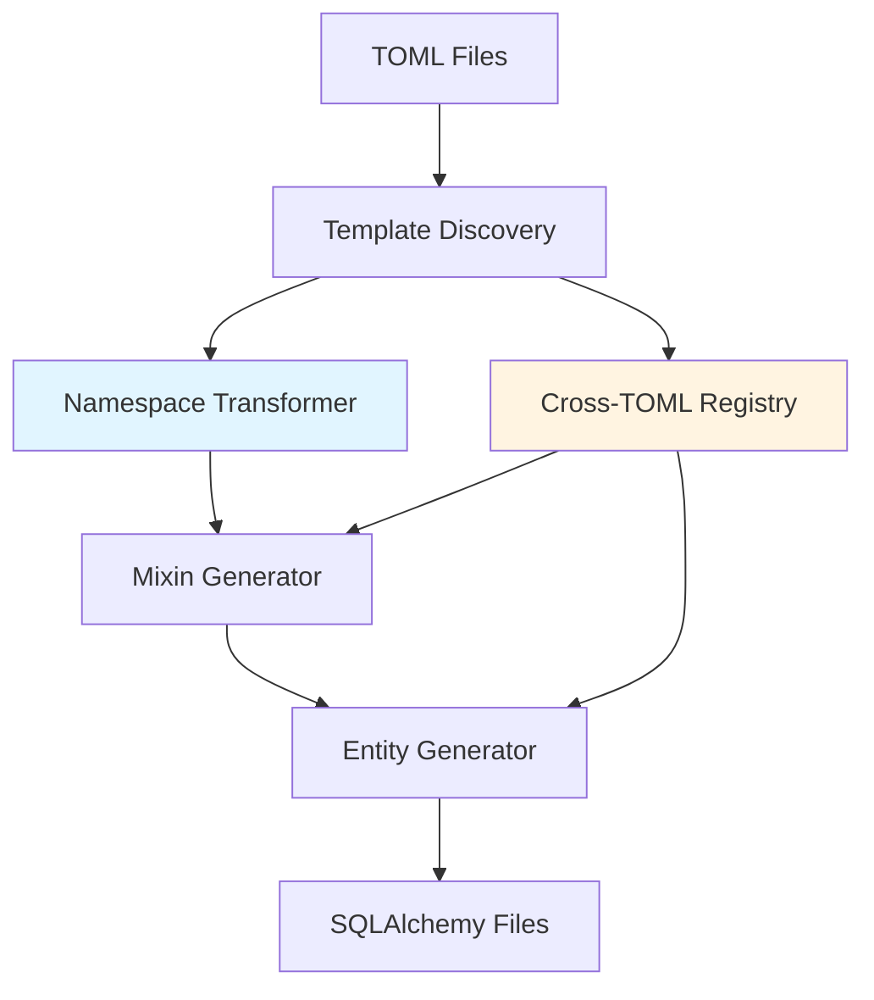
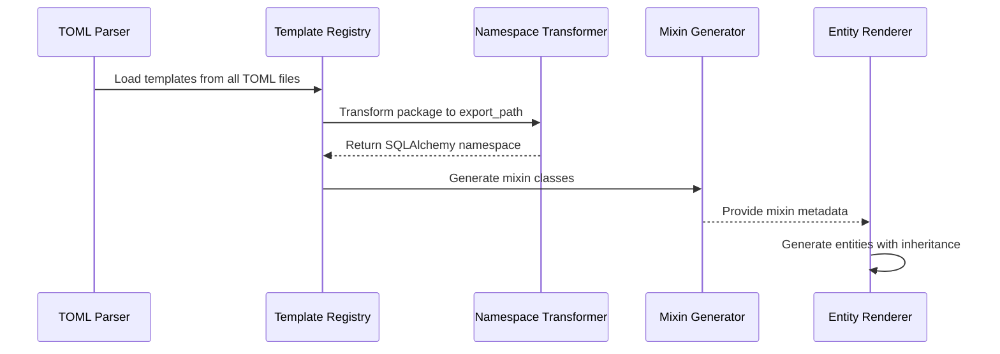

# Design Document: Automatic Namespace-Based Mixin Generation

## Overview

Enable automatic generation of SQLAlchemy mixin classes from TOML templates with automatic namespace transformation. The system converts Django package namespaces to SQLAlchemy equivalents by appending `_sqlalchemy` suffix to the last component of the package path, generates mixin files in the transformed namespace, and allows entities across multiple TOML files to reference these mixins.

## Architecture



## Main Algorithm/Workflow



## Components and Interfaces

### Component 1: Namespace Transformer

**Purpose**: Convert Django package namespaces to SQLAlchemy equivalents

**Interface**:
```python
class NamespaceTransformer:
    def transform_package_to_export_path(
        self, 
        package: str, 
        output_framework: str = 'sqlalchemy'
    ) -> str:
        """
        Transform Django package to SQLAlchemy export path.
        
        Args:
            package: Django package path (e.g., "kinkotech.common.infrastructure.models.base")
            output_framework: Target framework (default: "sqlalchemy")
            
        Returns:
            SQLAlchemy export path (e.g., "kinkotech.common.infrastructure.models.base_sqlalchemy")
        """
        pass
```

**Preconditions:**
- `package` is non-empty string
- `package` contains at least one component

**Postconditions:**
- Returns valid Python package path
- Last component has `_sqlalchemy` suffix appended
- Original package structure preserved except last component

**Responsibilities**:
- Parse package path into components
- Apply transformation rule based on output framework
- Validate transformed path

### Component 2: Template Registry

**Purpose**: Discover and manage templates across multiple TOML files

**Interface**:
```python
class TemplateRegistry:
    def discover_templates(self, toml_files: List[str]) -> Dict[str, TemplateInfo]:
        """
        Discover templates from multiple TOML files.
        
        Args:
            toml_files: List of TOML file paths
            
        Returns:
            Dictionary mapping template names to template information
        """
        pass
    
    def resolve_template(self, template_name: str) -> Optional[TemplateInfo]:
        """
        Resolve template by name across all loaded TOML files.
        
        Args:
            template_name: Name of template to resolve
            
        Returns:
            TemplateInfo if found, None otherwise
        """
        pass
```

**Preconditions:**
- `toml_files` is valid list of file paths
- TOML files are readable and well-formed

**Postconditions:**
- All templates from all files are registered
- Template names are unique across files (or conflict resolution applied)
- Registry is ready for template resolution

**Responsibilities**:
- Scan multiple TOML files for template definitions
- Build unified template registry
- Handle template name conflicts
- Provide template lookup by name

### Component 3: Mixin Generator

**Purpose**: Generate SQLAlchemy mixin class files from templates

**Interface**:
```python
class MixinGenerator:
    def generate_mixin_file(
        self, 
        template_name: str, 
        template_info: TemplateInfo,
        output_dir: str
    ) -> str:
        """
        Generate mixin class file from template.
        
        Args:
            template_name: Name of the template
            template_info: Template information including columns and export_path
            output_dir: Base output directory
            
        Returns:
            Path to generated mixin file
        """
        pass
```

**Preconditions:**
- `template_info` contains valid columns
- `template_info.export_path` is set (auto-derived or explicit)
- `output_dir` is writable directory

**Postconditions:**
- Mixin file created at correct path
- File contains valid SQLAlchemy mixin class
- Class marked as `__abstract__ = True`
- All columns properly defined

**Responsibilities**:
- Create directory structure for mixin
- Generate Python class with SQLAlchemy columns
- Write file to correct location
- Handle file naming conventions

### Component 4: Entity Renderer (Enhanced)

**Purpose**: Render entities with mixin inheritance support

**Interface**:
```python
class EntityRenderer:
    def render_entity(
        self, 
        entity: Entity, 
        templates: Dict[str, TemplateInfo],
        inheritance_mode: str = 'reference'
    ) -> str:
        """
        Render entity with mixin inheritance.
        
        Args:
            entity: Entity to render
            templates: Available templates
            inheritance_mode: 'reference' or 'flatten'
            
        Returns:
            Generated Python code
        """
        pass
```

**Preconditions:**
- `entity` is valid Entity object
- `templates` contains all referenced templates
- `inheritance_mode` is either 'reference' or 'flatten'

**Postconditions:**
- Returns valid Python code
- In reference mode: imports mixins and inherits from them
- In flatten mode: expands all fields inline
- Preserves field order and attributes

**Responsibilities**:
- Generate entity class with proper inheritance
- Import required mixins
- Handle both reference and flatten modes
- Preserve field metadata

## Data Models

### TemplateInfo

```python
@dataclass
class TemplateInfo:
    name: str
    package: Optional[str]  # Django package path
    export_path: Optional[str]  # SQLAlchemy export path (auto-derived or explicit)
    columns: List[Column]
    source_file: str  # TOML file where template is defined
```

**Validation Rules**:
- Either `package` or `export_path` must be specified
- If both specified, `export_path` takes precedence
- `columns` must be non-empty list
- `source_file` must be valid file path

### TransformationRule

```python
@dataclass
class TransformationRule:
    framework: str  # 'sqlalchemy', 'django', etc.
    suffix: str  # '_sqlalchemy', '_django', etc.
    
    def apply(self, package: str) -> str:
        """Apply transformation rule to package path."""
        pass
```

**Validation Rules**:
- `framework` must be non-empty string
- `suffix` must start with underscore
- Transformation must be reversible

## Algorithmic Pseudocode

### Namespace Transformation Algorithm

```pascal
ALGORITHM transformPackageToExportPath(package, framework)
INPUT: package (string), framework (string, default='sqlalchemy')
OUTPUT: export_path (string)

BEGIN
  ASSERT package IS NOT NULL AND package IS NOT EMPTY
  ASSERT framework IN ['sqlalchemy', 'django']
  
  // Step 1: Split package into components
  components ← SPLIT(package, '.')
  ASSERT LENGTH(components) >= 1
  
  // Step 2: Get transformation suffix based on framework
  IF framework = 'sqlalchemy' THEN
    suffix ← '_sqlalchemy'
  ELSE IF framework = 'django' THEN
    suffix ← '_django'
  ELSE
    RAISE ValueError("Unsupported framework")
  END IF
  
  // Step 3: Transform last component
  last_component ← components[LENGTH(components) - 1]
  
  // Check if already transformed
  IF last_component ENDS WITH suffix THEN
    RETURN package  // Already transformed
  END IF
  
  // Apply transformation
  transformed_component ← last_component + suffix
  components[LENGTH(components) - 1] ← transformed_component
  
  // Step 4: Reconstruct package path
  export_path ← JOIN(components, '.')
  
  ASSERT export_path IS NOT NULL
  ASSERT export_path CONTAINS suffix
  
  RETURN export_path
END
```

**Preconditions:**
- package is non-null and non-empty string
- framework is valid framework identifier
- package contains valid Python identifier components

**Postconditions:**
- export_path is valid Python package path
- Last component has framework suffix appended
- Original structure preserved except last component
- Idempotent: applying twice returns same result

**Loop Invariants:** N/A (no loops in main logic)

### Template Discovery Algorithm

```pascal
ALGORITHM discoverTemplates(toml_files)
INPUT: toml_files (list of file paths)
OUTPUT: templates (dictionary mapping template name to TemplateInfo)

BEGIN
  ASSERT toml_files IS NOT NULL
  ASSERT ALL files IN toml_files ARE READABLE
  
  templates ← EMPTY_DICTIONARY
  
  FOR each file_path IN toml_files DO
    ASSERT FILE_EXISTS(file_path)
    
    // Parse TOML file
    data ← PARSE_TOML(file_path)
    
    // Extract templates section
    IF 'templates' IN data THEN
      template_section ← data['templates']
      
      FOR each template_name, template_data IN template_section DO
        // Check for conflicts
        IF template_name IN templates THEN
          RAISE ConflictError("Duplicate template: " + template_name)
        END IF
        
        // Extract package and export_path
        package ← template_data.GET('package', NULL)
        export_path ← template_data.GET('export_path', NULL)
        
        // Auto-derive export_path if only package specified
        IF package IS NOT NULL AND export_path IS NULL THEN
          export_path ← transformPackageToExportPath(package, 'sqlalchemy')
        END IF
        
        // Parse columns
        columns ← PARSE_COLUMNS(template_data.GET('columns', []))
        
        // Create TemplateInfo
        template_info ← TemplateInfo(
          name=template_name,
          package=package,
          export_path=export_path,
          columns=columns,
          source_file=file_path
        )
        
        templates[template_name] ← template_info
      END FOR
    END IF
  END FOR
  
  ASSERT ALL template IN templates HAS VALID export_path
  
  RETURN templates
END
```

**Preconditions:**
- toml_files is non-null list
- All files in toml_files exist and are readable
- TOML files are well-formed

**Postconditions:**
- All templates from all files are discovered
- Each template has valid export_path (auto-derived or explicit)
- No duplicate template names
- All templates have parsed columns

**Loop Invariants:**
- All processed templates have unique names
- All templates have valid export_path
- templates dictionary remains consistent

### Mixin Generation Algorithm

```pascal
ALGORITHM generateMixinFile(template_name, template_info, output_dir)
INPUT: template_name (string), template_info (TemplateInfo), output_dir (string)
OUTPUT: file_path (string)

BEGIN
  ASSERT template_name IS NOT NULL
  ASSERT template_info.export_path IS NOT NULL
  ASSERT output_dir IS WRITABLE
  
  // Step 1: Convert export_path to file path
  // e.g., "kinkotech.common.models.base_sqlalchemy" -> "kinkotech/common/models/base_sqlalchemy"
  package_path ← REPLACE(template_info.export_path, '.', '/')
  
  // Step 2: Create class name from template name
  // e.g., "KinkoTechModelBase" -> "KinkoTechModelBase"
  class_name ← template_name
  
  // Step 3: Create file name from class name
  // e.g., "KinkoTechModelBase" -> "kinkotech_model_base.py"
  file_name ← TO_SNAKE_CASE(class_name) + '.py'
  
  // Step 4: Construct full file path
  full_dir_path ← JOIN_PATH(output_dir, package_path)
  file_path ← JOIN_PATH(full_dir_path, file_name)
  
  // Step 5: Create directory structure
  CREATE_DIRECTORIES(full_dir_path)
  
  // Step 6: Generate Python code
  code ← GENERATE_MIXIN_CLASS(
    class_name=class_name,
    columns=template_info.columns,
    abstract=TRUE
  )
  
  // Step 7: Write file
  WRITE_FILE(file_path, code)
  
  ASSERT FILE_EXISTS(file_path)
  ASSERT FILE_IS_VALID_PYTHON(file_path)
  
  RETURN file_path
END
```

**Preconditions:**
- template_name is non-empty string
- template_info has valid export_path
- template_info has non-empty columns list
- output_dir is writable directory

**Postconditions:**
- Mixin file created at correct path
- File contains valid Python code
- Class is marked as abstract
- All columns properly defined
- Directory structure created if needed

**Loop Invariants:** N/A (no explicit loops, but column iteration in GENERATE_MIXIN_CLASS maintains column order)

## Key Functions with Formal Specifications

### Function 1: transform_package_to_export_path()

```python
def transform_package_to_export_path(
    package: str, 
    output_framework: str = 'sqlalchemy'
) -> str
```

**Preconditions:**
- `package` is non-null and non-empty string
- `package` contains valid Python identifiers separated by dots
- `output_framework` is supported framework name

**Postconditions:**
- Returns valid Python package path
- Last component has framework suffix appended
- Idempotent: f(f(x)) = f(x)
- Preserves all components except last

**Loop Invariants:** N/A

### Function 2: discover_templates()

```python
def discover_templates(toml_files: List[str]) -> Dict[str, TemplateInfo]
```

**Preconditions:**
- `toml_files` is non-null list
- All files exist and are readable
- TOML files are well-formed

**Postconditions:**
- Returns dictionary with all discovered templates
- All templates have unique names
- All templates have valid export_path
- Template count equals sum of templates in all files

**Loop Invariants:**
- For each processed file: all templates from that file are registered
- No duplicate template names exist in registry
- All registered templates have valid export_path

### Function 3: generate_mixin_file()

```python
def generate_mixin_file(
    template_name: str,
    template_info: TemplateInfo,
    output_dir: str
) -> str
```

**Preconditions:**
- `template_name` is non-empty string
- `template_info.export_path` is set
- `template_info.columns` is non-empty
- `output_dir` is writable

**Postconditions:**
- Returns path to created file
- File exists and contains valid Python
- Class is marked as `__abstract__ = True`
- All columns from template are defined

**Loop Invariants:**
- For each column: column definition is valid SQLAlchemy syntax

## Example Usage

```python
# Example 1: Transform package to export path
package = "kinkotech.common.infrastructure.models.base"
export_path = transform_package_to_export_path(package, 'sqlalchemy')
# Result: "kinkotech.common.infrastructure.models.base_sqlalchemy"

# Example 2: Discover templates from multiple TOML files
toml_files = [
    "kinkotech/common/infrastructure/models.toml",
    "kinkotech/rfc_backend/domains/rfc_tour_guide/models.toml"
]
templates = discover_templates(toml_files)
# Result: Dictionary with all templates from both files

# Example 3: Generate mixin file
template_info = templates["KinkoTechModelBase"]
file_path = generate_mixin_file(
    "KinkoTechModelBase",
    template_info,
    output_dir="output"
)
# Result: "output/kinkotech/common/infrastructure/models/base_sqlalchemy/kinkotech_model_base.py"

# Example 4: TOML template definition with auto-derived export_path
"""
[templates.KinkoTechModelBase]
package = "kinkotech.common.infrastructure.models.base"
# export_path auto-derived: kinkotech.common.infrastructure.models.base_sqlalchemy

[[templates.KinkoTechModelBase.columns]]
name = "id"
type = "bigint"
primary_key = true
"""

# Example 5: Entity referencing template
"""
[entities.POI]
extends = ["KinkoTechModelBase", "CreateModifyMixinModel"]
table_name = "kkt_rfc_tour_guide_poimodel"

[[entities.POI.columns]]
name = "name"
type = "string"
max_length = 255
"""
```

## Correctness Properties

*A property is a characteristic or behavior that should hold true across all valid executions of a system—essentially, a formal statement about what the system should do. Properties serve as the bridge between human-readable specifications and machine-verifiable correctness guarantees.*

### Property 1: Namespace Transformation Idempotence

*For any* valid package path, transforming it twice should produce the same result as transforming it once.

**Validates: Requirements 1.2, 1.3**

### Property 2: Namespace Transformation Suffix Application

*For any* valid package path without the `_sqlalchemy` suffix, transformation should append the suffix to the last component only.

**Validates: Requirements 1.1, 1.4**

### Property 3: Template Discovery Completeness

*For any* set of TOML files with templates, all templates from all files should be discovered and registered.

**Validates: Requirements 2.1**

### Property 4: Export Path Auto-Derivation

*For any* template with a `package` field but no `export_path` field, the export_path should be auto-derived by applying namespace transformation to the package.

**Validates: Requirements 2.2**

### Property 5: Export Path Precedence

*For any* template with both `package` and `export_path` fields, the explicit `export_path` should be used unchanged.

**Validates: Requirements 2.3**

### Property 6: Template Resolution Across Files

*For any* template name in the registry, it should be resolvable regardless of which TOML file defined it.

**Validates: Requirements 3.1, 8.1**

### Property 7: Registry Completeness Invariant

*For any* completed template discovery, all templates in the registry should have valid, non-null export paths.

**Validates: Requirements 3.3, 3.4**

### Property 8: Mixin File Path Construction

*For any* template with an export_path, the generated mixin file should be created at the path derived by converting dots to directory separators and the class name to snake_case with `.py` extension.

**Validates: Requirements 4.1, 6.1, 6.2, 6.3**

### Property 9: Mixin Abstract Class Generation

*For any* generated mixin file, it should contain a class with `__abstract__ = True` attribute.

**Validates: Requirements 4.2**

### Property 10: Mixin Column Completeness

*For any* template with columns, all columns should appear in the generated mixin class.

**Validates: Requirements 4.3**

### Property 11: Directory Structure Creation

*For any* mixin file generation, all intermediate directories in the path should be created if they don't exist.

**Validates: Requirements 4.4, 6.4**

### Property 12: Reference Mode Import Generation

*For any* entity extending templates in reference mode, the generated code should include import statements for all mixin classes.

**Validates: Requirements 5.1**

### Property 13: Reference Mode Inheritance

*For any* entity extending templates in reference mode, the generated class should inherit from all referenced mixin classes.

**Validates: Requirements 5.2**

### Property 14: Flatten Mode Field Expansion

*For any* entity extending templates in flatten mode, all fields from all referenced templates should be expanded inline in the entity.

**Validates: Requirements 5.3**

### Property 15: Field Order Preservation

*For any* entity with template inheritance, the order of fields should be preserved (template fields first, then entity-specific fields).

**Validates: Requirements 5.4**

### Property 16: Export Path Validation

*For any* template in the registry, the export_path should be a valid Python package path.

**Validates: Requirements 7.4**

### Property 17: Template Name Validation

*For any* template in the registry, the template name should be a valid Python identifier.

**Validates: Requirements 7.5**

### Property 18: Source File Metadata

*For any* template in the registry, it should maintain metadata about which TOML file it came from.

**Validates: Requirements 8.2**

### Property 19: Cross-File Import Path Correctness

*For any* entity referencing a template from a different file, the generated import path should be correct and based on the template's export_path.

**Validates: Requirements 8.3**

### Property 20: Generated Code Syntactic Validity

*For any* generated mixin or entity file, the Python code should be syntactically valid and parseable.

**Validates: Requirements 9.1**

### Property 21: SQLAlchemy Import Presence

*For any* generated mixin file, it should include the necessary SQLAlchemy imports.

**Validates: Requirements 9.2**

### Property 22: Entity Import Statement Validity

*For any* entity with template inheritance in reference mode, all import statements should be syntactically valid.

**Validates: Requirements 9.4**

### Property 23: Entity Inheritance Syntax Validity

*For any* entity with template inheritance, the class inheritance syntax should be valid Python.

**Validates: Requirements 9.5**

## Error Handling

### Error Scenario 1: Duplicate Template Names

**Condition**: Two TOML files define templates with the same name
**Response**: Raise ConflictError with details about conflicting files
**Recovery**: User must rename one template or use explicit namespacing

### Error Scenario 2: Invalid Package Path

**Condition**: Package path contains invalid Python identifiers
**Response**: Raise ValueError with details about invalid component
**Recovery**: User must fix package path in TOML file

### Error Scenario 3: Missing Template Reference

**Condition**: Entity references template that doesn't exist
**Response**: Raise TemplateNotFoundError with template name and entity
**Recovery**: User must define template or fix reference

### Error Scenario 4: Circular Template Dependencies

**Condition**: Template A extends template B which extends template A
**Response**: Raise CircularDependencyError with dependency chain
**Recovery**: User must break circular dependency

## Testing Strategy

### Unit Testing Approach

Test each component in isolation:
- Namespace transformer with various package formats
- Template registry with multiple TOML files
- Mixin generator with different column types
- Entity renderer with various inheritance scenarios

Key test cases:
- Simple package transformation
- Package already transformed (idempotence)
- Empty package components
- Single-component package
- Template discovery from single file
- Template discovery from multiple files
- Duplicate template detection
- Mixin generation with various column types
- Entity rendering in reference mode
- Entity rendering in flatten mode

### Property-Based Testing Approach

**Property Test Library**: hypothesis (Python)

Properties to test:
1. Transformation idempotence: `transform(transform(x)) == transform(x)`
2. Transformation reversibility: Can extract original package from transformed
3. Template discovery completeness: All templates in files are discovered
4. Mixin generation validity: Generated files are valid Python
5. Export path consistency: Auto-derived paths follow naming convention

### Integration Testing Approach

End-to-end tests:
1. Load multiple TOML files with templates
2. Discover all templates
3. Generate mixin files
4. Generate entity files with inheritance
5. Verify generated code is valid and imports work
6. Test both reference and flatten modes

## Performance Considerations

- Template discovery should cache results to avoid re-parsing TOML files
- Namespace transformation is O(n) where n is number of package components
- Mixin generation should be parallelizable for multiple templates
- File I/O should be minimized by batching writes

## Security Considerations

- Validate all package paths to prevent directory traversal attacks
- Sanitize template names to prevent code injection
- Ensure generated files don't overwrite system files
- Validate TOML input to prevent malicious content

## Dependencies

- `toml` or `tomli`: TOML parsing
- `pathlib`: Path manipulation
- `jinja2`: Template rendering for code generation
- `dataclasses`: Data model definitions
- Existing `er-gen-core` components: Parser, Entity, Column models
