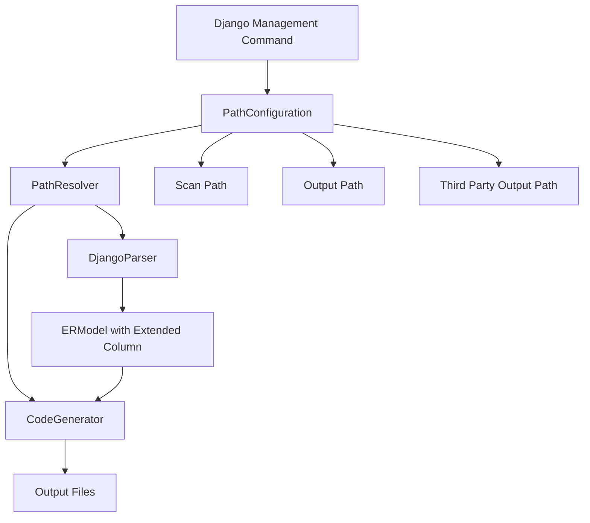
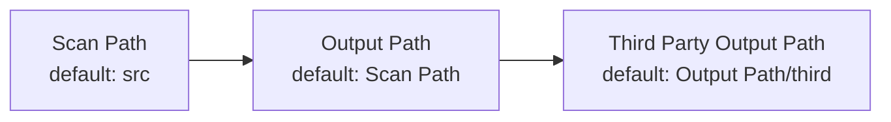

# Design Document: Field DB Column and Path Separation

## Overview

本设计文档描述了ER模型生成工具中三个核心功能的实现方案：

1. **Django字段db_column参数支持**：扩展Column数据模型以支持业务字段名和数据库列名的分离
2. **三方包输出路径分离**：引入独立的三方包输出路径配置，避免包名冲突
3. **扫描路径与输出路径分离**：支持独立配置源代码扫描路径和生成代码输出路径

这些功能将提供更灵活的配置选项，同时保持向后兼容性。

## Architecture

### 系统组件关系



### 配置继承关系



## Components and Interfaces

### 1. Extended Column Model

扩展现有的`Column`数据类以支持db_column：

```python
@dataclass
class Column:
    name: str  # 业务字段名称
    type: str
    db_column: str  # 数据库列名（必需）
    is_pk: bool = False
    is_fk: bool = False
    nullable: bool = True
    comment: Optional[str] = None
    default: Optional[str] = None
    max_length: Optional[int] = None
    precision: Optional[int] = None
    scale: Optional[int] = None
    unique: bool = False
    indexed: bool = False
    
    @property
    def database_column_name(self) -> str:
        """返回实际的数据库列名"""
        return self.db_column
```

### 2. PathConfiguration Class

新增配置类来管理所有路径相关的配置：

```python
@dataclass
class PathConfiguration:
    """路径配置管理类"""
    scan_path: Path
    output_path: Path
    third_party_output_path: Path
    third_party_package_prefix: Optional[str] = None
    
    @classmethod
    def from_options(
        cls,
        scan_path: Optional[str] = None,
        output_path: Optional[str] = None,
        third_party_output_path: Optional[str] = None,
        third_party_package_prefix: Optional[str] = None,
        working_dir: Optional[Path] = None
    ) -> 'PathConfiguration':
        """
        从命令行选项创建配置对象，应用默认值和继承规则
        
        继承规则：
        1. scan_path默认为'src'
        2. output_path默认继承scan_path
        3. third_party_output_path默认为output_path/third
        4. third_party_package_prefix默认为third_party_output_path的最后一个目录名
        """
        working_dir = working_dir or Path.cwd()
        
        # 应用默认值和继承规则
        resolved_scan_path = Path(scan_path) if scan_path else Path('src')
        resolved_output_path = Path(output_path) if output_path else resolved_scan_path
        
        # 解析相对路径
        if not resolved_scan_path.is_absolute():
            resolved_scan_path = working_dir / resolved_scan_path
        if not resolved_output_path.is_absolute():
            resolved_output_path = working_dir / resolved_output_path
            
        # 处理third_party_output_path
        if third_party_output_path:
            resolved_third_path = Path(third_party_output_path)
            # 如果是相对路径，相对于output_path解析
            if not resolved_third_path.is_absolute():
                resolved_third_path = resolved_output_path / resolved_third_path
        else:
            resolved_third_path = resolved_output_path / 'third'
        
        # 处理包名前缀
        if third_party_package_prefix is None:
            # 使用third_party_output_path的最后一个目录名
            third_party_package_prefix = resolved_third_path.name
        
        return cls(
            scan_path=resolved_scan_path,
            output_path=resolved_output_path,
            third_party_output_path=resolved_third_path,
            third_party_package_prefix=third_party_package_prefix
        )
    
    def validate(self) -> List[str]:
        """验证配置的有效性，返回错误列表"""
        errors = []
        
        # 验证scan_path存在
        if not self.scan_path.exists():
            errors.append(f"Scan path does not exist: {self.scan_path}")
        
        # 验证包名前缀格式
        if self.third_party_package_prefix:
            if not self.third_party_package_prefix.isidentifier():
                errors.append(
                    f"Invalid package prefix: {self.third_party_package_prefix}. "
                    "Must be a valid Python identifier."
                )
        
        return errors
```

### 3. Enhanced PathResolver

扩展现有的`PathResolver`以支持新的路径配置：

```python
class PathResolver:
    """路径解析工具类"""
    
    def __init__(self, config: PathConfiguration):
        self.config = config
    
    def resolve_output_path(
        self,
        app_config: AppConfig,
        format: str,
        is_third_party: bool = False
    ) -> Path:
        """
        解析应用的输出路径
        
        Args:
            app_config: Django AppConfig实例
            format: 输出格式（toml, py等）
            is_third_party: 是否为三方包
            
        Returns:
            输出文件的完整路径
        """
        base_dir = (
            self.config.third_party_output_path 
            if is_third_party 
            else self.config.output_path
        )
        
        package_path = app_config.name
        relative_path = Path(package_path.replace('.', os.sep))
        
        return base_dir / relative_path / f'models.{format}'
    
    def resolve_package_name(
        self,
        app_config: AppConfig,
        is_third_party: bool = False
    ) -> str:
        """
        解析应用的包名
        
        Args:
            app_config: Django AppConfig实例
            is_third_party: 是否为三方包
            
        Returns:
            完整的包名（三方包会添加前缀）
        """
        base_package = app_config.name
        
        if is_third_party and self.config.third_party_package_prefix:
            return f"{self.config.third_party_package_prefix}.{base_package}"
        
        return base_package
    
    def get_scan_path(self) -> Path:
        """返回扫描路径"""
        return self.config.scan_path
```

### 4. Django Parser Enhancement

扩展Django解析器以提取db_column参数：

```python
class DjangoModelParser:
    """Django模型解析器"""
    
    def _convert_field_to_column(self, field) -> Column:
        """
        转换Django字段为Column
        
        提取字段名称、类型和db_column参数
        db_column必须存在，如果字段没有指定则使用field.column或field.name
        """
        # 获取数据库列名
        if hasattr(field, 'db_column') and field.db_column:
            db_column = field.db_column
        elif hasattr(field, 'column'):
            db_column = field.column
        else:
            db_column = field.name
        
        return Column(
            name=field.name,
            type=field_type,
            db_column=db_column,  # 必需字段
            # ... 其他属性
        )
    
    def _convert_model_to_entity(self, model: Type[models.Model]) -> Entity:
        """
        转换Django模型为Entity
        
        table_name必须存在，直接从model._meta.db_table获取
        """
        # 获取数据库表名（必需）
        table_name = model._meta.db_table
        
        return Entity(
            name=model.__name__,
            table_name=table_name,  # 必需字段
            # ... 其他属性
        )
```

### 5. TOML Renderer Enhancement

扩展TOML渲染器以输出db_column信息：

```python
class TOMLRenderer:
    """TOML格式渲染器"""
    
    def render_column(self, column: Column) -> Dict[str, Any]:
        """
        渲染列定义到TOML格式
        
        只在db_column与name不同时输出db_column字段
        """
        result = {
            'name': column.name,
            'type': column.type,
            # ... 其他字段
        }
        
        # 只在db_column与name不同时输出
        if column.db_column != column.name:
            result['db_column'] = column.db_column
        
        return result
```

### 6. Code Generator Enhancement

扩展代码生成器以使用正确的数据库列名和表名：

```python
class DjangoCodeGenerator:
    """Django代码生成器"""
    
    def generate_field_definition(self, column: Column) -> str:
        """
        生成Django字段定义代码
        
        只在db_column与name不同时添加db_column参数
        """
        params = []
        
        # ... 其他参数
        
        # 只在db_column与name不同时添加db_column参数
        if column.db_column != column.name:
            params.append(f"db_column='{column.db_column}'")
        
        return f"{column.name} = models.{column.type}({', '.join(params)})"
    
    def generate_model_meta(self, entity: Entity) -> str:
        """
        生成Django模型的Meta类
        
        始终添加db_table参数以明确指定数据库表名
        """
        return f"""
    class Meta:
        db_table = '{entity.table_name}'
"""
```

## Data Models

### Column Model Changes

```python
# 修改前
@dataclass
class Column:
    name: str
    type: str
    # ...

@dataclass
class Entity:
    name: str
    table_name: Optional[str] = None
    # ...

# 修改后
@dataclass
class Column:
    name: str  # 业务字段名
    type: str
    db_column: str  # 数据库列名（必需）
    # ...
    
    @property
    def database_column_name(self) -> str:
        return self.db_column

@dataclass
class Entity:
    name: str  # 业务模型名
    table_name: str  # 数据库表名（必需）
    # ...
```

### TOML Format Changes

```toml
# 修改前（table_name可选）
[[entities.User.columns]]
name = "username"
type = "CharField"

[entities.User]
name = "User"

# 修改后（db_column与name不同时才输出）
[[entities.User.columns]]
name = "username"
db_column = "user_name"  # 与name不同，需要输出
type = "CharField"

[entities.User]
name = "User"
table_name = "auth_user"  # 必需字段，明确数据库表名

# 当业务名和数据库列名相同时
[[entities.User.columns]]
name = "email"
# db_column不输出，因为与name相同
type = "EmailField"
```

### Command Line Interface Changes

```bash
# 新增参数
uv run python manage.py er_export \
    --scan-path src \
    --output-dir output \
    --third-party-output-dir output/third \
    --third-party-prefix third

uv run python manage.py er_convert \
    --scan-path src \
    --output-dir output \
    --third-party-output-dir output/third \
    --third-party-prefix third
```

## Correctness Properties

*属性是一个特征或行为，应该在系统的所有有效执行中保持为真——本质上是关于系统应该做什么的形式化陈述。属性作为人类可读规范和机器可验证正确性保证之间的桥梁。*

### Property 1: db_column参数始终存在

*对于任何*解析后的Column对象，db_column字段必须是非空字符串，如果Django字段没有指定db_column，则使用field.column或field.name

**Validates: Requirements 1.1, 1.3**

### Property 2: 数据库列名始终存在

*对于任何*Column对象，database_column_name属性应该等于db_column字段的值，且db_column必须是非空字符串

**Validates: Requirements 1.2**

### Property 3: TOML输出条件包含db_column

*对于任何*Column对象，如果db_column与name不同，TOML输出必须包含db_column字段；如果相同，则不输出db_column字段；*对于任何*Entity对象，TOML输出必须包含table_name字段

**Validates: Requirements 1.4**

### Property 4: 默认Third_Party_Output_Path推导

*对于任何*未指定third_party_output_path的配置，解析后的third_party_output_path应该等于output_path加上'third'子目录

**Validates: Requirements 2.2**

### Property 5: 自定义Third_Party_Output_Path优先级

*对于任何*指定了third_party_output_path的配置，解析后的third_party_output_path应该等于用户指定的值（经过路径解析后）

**Validates: Requirements 2.3**

### Property 6: 三方包名前缀添加

*对于任何*标记为三方包的应用，其解析后的包名应该以third_party_package_prefix开头，格式为"{prefix}.{original_package}"

**Validates: Requirements 2.4**

### Property 7: 自定义包名前缀使用

*对于任何*指定了third_party_package_prefix的配置，三方包的包名前缀应该使用用户指定的值

**Validates: Requirements 2.6**

### Property 8: 默认包名前缀推导

*对于任何*未指定third_party_package_prefix的配置，包名前缀应该等于third_party_output_path的最后一个目录名

**Validates: Requirements 2.7**

### Property 9: 导入语句使用带前缀包名

*对于任何*三方包的引用，生成的导入语句应该使用带前缀的完整包名

**Validates: Requirements 2.8**

### Property 10: 默认Scan_Path值

*对于任何*未指定scan_path的配置，解析后的scan_path应该等于'src'目录（相对于工作目录）

**Validates: Requirements 3.3**

### Property 11: Output_Path继承Scan_Path

*对于任何*未指定output_path但指定了scan_path的配置，解析后的output_path应该等于scan_path

**Validates: Requirements 3.4**

### Property 12: 路径分离功能正确性

*对于任何*scan_path和output_path不同的配置，系统应该从scan_path读取源代码并将生成的代码输出到output_path

**Validates: Requirements 3.6**

### Property 13: 仅Scan_Path配置的继承链

*对于任何*仅指定scan_path的配置，output_path应该等于scan_path，且third_party_output_path应该等于scan_path加上'third'子目录

**Validates: Requirements 4.1**

### Property 14: Scan_Path和Output_Path配置的继承链

*对于任何*指定了scan_path和output_path但未指定third_party_output_path的配置，third_party_output_path应该等于output_path加上'third'子目录

**Validates: Requirements 4.2**

### Property 15: 完整配置优先级

*对于任何*指定了所有路径参数的配置，解析后的所有路径值应该等于用户指定的值（经过路径解析后）

**Validates: Requirements 4.3**

### Property 16: 相对路径解析基准

*对于任何*使用相对路径的scan_path或output_path配置，解析后的绝对路径应该相对于当前工作目录

**Validates: Requirements 4.4**

### Property 17: Third_Party相对路径解析基准

*对于任何*使用相对路径的third_party_output_path配置，解析后的绝对路径应该相对于output_path

**Validates: Requirements 4.5**

## Error Handling

### 错误场景和处理策略

1. **Scan_Path不存在**
   - 错误类型：`ConfigurationError`
   - 错误消息：`"Scan path does not exist: {path}"`
   - 处理：立即失败，不尝试创建目录

2. **Output_Path无法创建**
   - 错误类型：`IOError`
   - 错误消息：`"Cannot create output directory: {path}. Reason: {reason}"`
   - 处理：立即失败，提供详细的失败原因

3. **路径权限不足**
   - 错误类型：`PermissionError`
   - 错误消息：`"Permission denied: {path}"`
   - 处理：立即失败，建议用户检查权限

4. **包名前缀无效**
   - 错误类型：`ValidationError`
   - 错误消息：`"Invalid package prefix: {prefix}. Must be a valid Python identifier."`
   - 处理：立即失败，提供有效标识符的规则

5. **配置参数类型错误**
   - 错误类型：`TypeError`
   - 错误消息：`"Invalid type for {param}: expected {expected_type}, got {actual_type}"`
   - 处理：立即失败，提供正确的类型信息

6. **db_column解析失败**
   - 错误类型：`ParseError`
   - 错误消息：`"Failed to parse db_column parameter in field {field_name}: {reason}"`
   - 处理：记录警告，使用字段名作为列名继续处理

## Testing Strategy

### 单元测试和属性测试的互补关系

本项目采用双重测试策略：

- **单元测试**：验证特定示例、边缘情况和错误条件
- **属性测试**：验证跨所有输入的通用属性

两者是互补的且都是必需的。单元测试捕获具体的错误，属性测试验证一般正确性。

### 属性测试配置

- 使用Python的`hypothesis`库进行属性测试
- 每个属性测试最少运行100次迭代（由于随机化）
- 每个属性测试必须引用其设计文档中的属性
- 标签格式：**Feature: field-db-column-and-path-separation, Property {number}: {property_text}**

### 测试覆盖范围

#### 单元测试重点

1. **db_column解析**
   - 测试各种db_column参数格式（单引号、双引号）
   - 测试缺失db_column的情况
   - 测试db_column与name相同的情况

2. **路径配置**
   - 测试各种路径组合
   - 测试相对路径和绝对路径
   - 测试路径不存在的错误情况

3. **包名转换**
   - 测试简单包名（aaa）
   - 测试嵌套包名（aaa.bbb.ccc）
   - 测试特殊字符处理

4. **错误处理**
   - 测试所有错误场景的错误消息
   - 测试错误恢复机制

#### 属性测试重点

1. **db_column属性（Properties 1-3）**
   - 生成随机的Django字段定义
   - 验证解析和输出的正确性

2. **路径配置属性（Properties 4-17）**
   - 生成随机的路径配置组合
   - 验证继承规则和解析逻辑

3. **包名转换属性（Properties 6-9）**
   - 生成随机的包名
   - 验证前缀添加和导入语句生成

### 集成测试

1. **端到端测试**
   - 使用真实的Django项目结构
   - 验证从解析到代码生成的完整流程
   - 测试向后兼容性

2. **回归测试**
   - 使用现有的示例项目
   - 确保新功能不破坏现有功能

### 测试数据生成策略

使用`hypothesis`的策略生成器：

```python
from hypothesis import strategies as st

# 字段名策略
field_names = st.text(
    alphabet=st.characters(whitelist_categories=('Lu', 'Ll')),
    min_size=1,
    max_size=20
).filter(str.isidentifier)

# 路径策略
paths = st.text(
    alphabet=st.characters(whitelist_categories=('Lu', 'Ll', 'Nd')) | st.just('/'),
    min_size=1,
    max_size=50
).filter(lambda x: not x.startswith('/') and not x.endswith('/'))

# 包名策略
package_names = st.lists(
    field_names,
    min_size=1,
    max_size=5
).map(lambda parts: '.'.join(parts))
```

## Implementation Notes

### 性能考虑

1. **路径解析**：在配置初始化时一次性完成，避免重复计算
2. **db_column提取**：在AST解析阶段完成，不增加额外的解析开销
3. **包名转换**：使用简单的字符串操作，性能影响可忽略

### 扩展性

设计支持未来的扩展：

1. **多种包名前缀策略**：可以扩展为支持自定义的前缀转换函数
2. **路径映射规则**：可以扩展为支持更复杂的路径映射配置
3. **字段元数据**：Column模型可以继续扩展以支持更多Django字段参数
