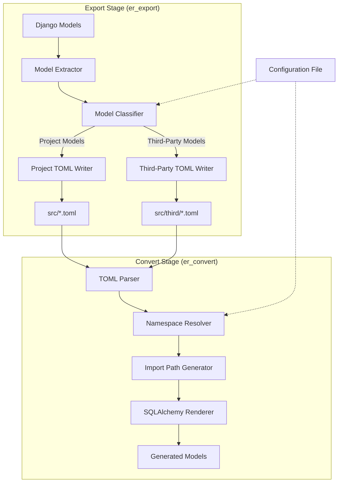
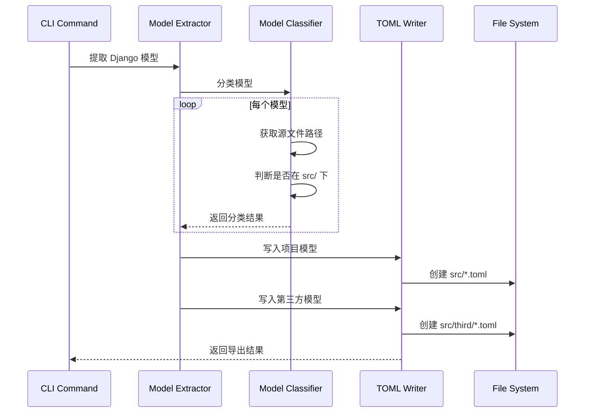
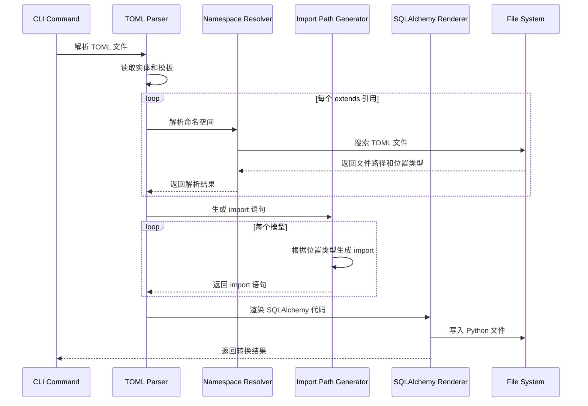

# 设计文档：命名空间驱动的模型导入导出系统

## 概述

命名空间驱动的模型导入导出系统是对现有 ER 模型转换工具的重大增强，它引入了基于 Python 模块命名空间的引用系统，取代了传统的文件路径依赖。该系统的核心目标是提高代码的可维护性、可移植性和可扩展性。

### 设计目标

1. **命名空间优先**：使用 Python 模块命名空间作为模型引用的唯一标识符
2. **自动路径解析**：在转换阶段自动解析命名空间到文件路径的映射
3. **第三方隔离**：清晰区分项目内模型和第三方库模型
4. **向后兼容**：支持现有 TOML 文件格式，提供迁移工具
5. **错误诊断**：提供详细的错误信息和调试支持

### 关键特性

- **命名空间引用系统**：所有模型继承关系使用 `extends = ["namespace.path.to.Model"]` 格式
- **智能文件组织**：按命名空间组织 TOML 文件，每个命名空间一个文件
- **双目录结构**：项目模型存储在 `src/`，第三方模型存储在 `src/third/`
- **自动导入生成**：根据模型位置自动生成正确的 Python import 语句
- **配置驱动**：支持通过配置文件自定义系统行为

## 架构

### 系统架构图



### 架构层次

系统采用分层架构，从下到上分为：

1. **存储层**：TOML 文件系统，按命名空间组织
2. **解析层**：TOML 解析器，读取模型定义
3. **解析层**：命名空间解析器，将命名空间映射到文件路径
4. **转换层**：导入路径生成器，生成 Python import 语句
5. **渲染层**：SQLAlchemy 渲染器，生成最终代码

### 数据流

#### Export 阶段数据流

```
Django Model → Model Extractor → Model Classifier → TOML Writer → TOML File
                                        ↓
                                  [Project/Third-Party]
                                        ↓
                                  [src/ or src/third/]
```

#### Convert 阶段数据流

```
TOML File → Parser → Namespace Resolver → Import Path Generator → Renderer → Python Code
                            ↓
                      [Search Paths]
                            ↓
                    [src/, src/third/]
```


## 组件和接口

### 1. NamespaceResolver（命名空间解析器）

命名空间解析器负责将 Python 模块命名空间转换为对应的 TOML 文件路径。

#### 职责

- 接收命名空间字符串（如 `kinkotech.common.models.base`）
- 按优先级搜索对应的 TOML 文件（先 `src/`，后 `src/third/`）
- 返回文件路径和位置类型（project 或 third-party）
- 处理未找到的情况，返回详细错误信息

#### 接口定义

```python
class NamespaceResolver:
    """解析命名空间到 TOML 文件路径"""
    
    def __init__(self, search_paths: List[str], config: Optional[Config] = None):
        """
        初始化解析器
        
        Args:
            search_paths: 搜索路径列表，按优先级排序
            config: 可选的配置对象
        """
        pass
    
    def resolve(self, namespace: str) -> ResolveResult:
        """
        解析命名空间到文件路径
        
        Args:
            namespace: Python 模块命名空间，如 "kinkotech.common.models.base"
            
        Returns:
            ResolveResult: 包含文件路径、位置类型和元数据
            
        Raises:
            NamespaceNotFoundError: 当命名空间无法解析时
        """
        pass
    
    def resolve_batch(self, namespaces: List[str]) -> Dict[str, ResolveResult]:
        """
        批量解析多个命名空间
        
        Args:
            namespaces: 命名空间列表
            
        Returns:
            字典，键为命名空间，值为解析结果
        """
        pass
```

#### 解析算法

1. 将命名空间中的点号（`.`）替换为路径分隔符（`/`）
2. 添加 `.toml` 扩展名
3. 按优先级遍历搜索路径：
   - 首先在 `src/` 目录下搜索
   - 如果未找到，在 `src/third/` 目录下搜索
4. 找到文件后，记录其位置类型
5. 如果所有路径都未找到，抛出 `NamespaceNotFoundError`

#### 示例

```python
resolver = NamespaceResolver(search_paths=["src/", "src/third/"])

# 解析项目内模型
result = resolver.resolve("kinkotech.common.models.base")
# result.file_path = "src/kinkotech/common/models/base.toml"
# result.location_type = "project"

# 解析第三方模型
result = resolver.resolve("django.contrib.auth.models")
# result.file_path = "src/third/django/contrib/auth/models.toml"
# result.location_type = "third-party"
```


### 2. ImportPathGenerator（导入路径生成器）

导入路径生成器根据模型的位置类型生成正确的 Python import 语句。

#### 职责

- 接收命名空间和位置类型
- 生成符合 Python 语法的 import 语句
- 处理项目内模型和第三方模型的不同导入方式
- 支持自定义第三方目录名称

#### 接口定义

```python
class ImportPathGenerator:
    """生成 Python import 语句"""
    
    def __init__(self, third_party_dir: str = "third"):
        """
        初始化生成器
        
        Args:
            third_party_dir: 第三方目录名称，默认为 "third"
        """
        pass
    
    def generate(self, namespace: str, location_type: str, model_name: str) -> str:
        """
        生成 import 语句
        
        Args:
            namespace: 模型的命名空间
            location_type: 位置类型，"project" 或 "third-party"
            model_name: 模型类名
            
        Returns:
            完整的 import 语句字符串
            
        Example:
            generate("kinkotech.common.models.base", "project", "BaseModel")
            # 返回: "from kinkotech.common.models.base import BaseModel"
            
            generate("django.contrib.auth.models", "third-party", "AbstractUser")
            # 返回: "from third.django.contrib.auth.models import AbstractUser"
        """
        pass
    
    def generate_batch(self, imports: List[ImportSpec]) -> List[str]:
        """
        批量生成 import 语句
        
        Args:
            imports: ImportSpec 对象列表
            
        Returns:
            import 语句列表
        """
        pass
```

#### 生成规则

1. **项目内模型**：直接使用命名空间
   ```python
   from {namespace} import {ModelName}
   ```

2. **第三方模型**：在命名空间前添加第三方目录前缀
   ```python
   from {third_party_dir}.{namespace} import {ModelName}
   ```

#### 示例

```python
generator = ImportPathGenerator(third_party_dir="third")

# 项目内模型
import_stmt = generator.generate(
    "kinkotech.common.models.base",
    "project",
    "BaseModel"
)
# 输出: "from kinkotech.common.models.base import BaseModel"

# 第三方模型
import_stmt = generator.generate(
    "django.contrib.auth.models",
    "third-party",
    "AbstractUser"
)
# 输出: "from third.django.contrib.auth.models import AbstractUser"
```


### 3. ModelClassifier（模型分类器）

模型分类器在 Export 阶段识别模型是项目内模型还是第三方模型。

#### 职责

- 检查模型的源代码路径
- 判断模型是否在项目 `src/` 目录内
- 返回模型的分类结果

#### 接口定义

```python
class ModelClassifier:
    """分类模型为项目内或第三方"""
    
    def __init__(self, project_root: str):
        """
        初始化分类器
        
        Args:
            project_root: 项目根目录路径
        """
        pass
    
    def classify(self, model_class: type) -> str:
        """
        分类模型
        
        Args:
            model_class: Django 模型类
            
        Returns:
            "project" 或 "third-party"
        """
        pass
    
    def get_namespace(self, model_class: type) -> str:
        """
        获取模型的命名空间
        
        Args:
            model_class: Django 模型类
            
        Returns:
            模型的完整命名空间，如 "kinkotech.common.models.base"
        """
        pass
```

#### 分类算法

1. 使用 `inspect.getfile()` 获取模型类的源文件路径
2. 将路径转换为绝对路径
3. 检查路径是否在项目 `src/` 目录下
4. 如果在 `src/` 目录下，返回 "project"
5. 否则返回 "third-party"

### 4. TOMLWriter（TOML 写入器）

TOML 写入器负责将模型定义写入到正确的 TOML 文件中。

#### 职责

- 根据命名空间确定文件路径
- 创建必要的目录结构
- 将模型定义序列化为 TOML 格式
- 处理同一命名空间的多个模型

#### 接口定义

```python
class TOMLWriter:
    """写入 TOML 文件"""
    
    def __init__(self, base_dir: str):
        """
        初始化写入器
        
        Args:
            base_dir: 基础目录，"src/" 或 "src/third/"
        """
        pass
    
    def write_entity(self, namespace: str, entity: EntityDefinition) -> str:
        """
        写入实体定义
        
        Args:
            namespace: 实体的命名空间
            entity: 实体定义对象
            
        Returns:
            写入的文件路径
        """
        pass
    
    def write_template(self, namespace: str, template: TemplateDefinition) -> str:
        """
        写入模板定义
        
        Args:
            namespace: 模板的命名空间
            template: 模板定义对象
            
        Returns:
            写入的文件路径
        """
        pass
```


### 5. ConfigurationManager（配置管理器）

配置管理器负责加载和管理系统配置。

#### 职责

- 加载配置文件
- 提供默认配置
- 验证配置有效性
- 提供配置访问接口

#### 接口定义

```python
class ConfigurationManager:
    """管理系统配置"""
    
    def __init__(self, config_path: Optional[str] = None):
        """
        初始化配置管理器
        
        Args:
            config_path: 配置文件路径，如果为 None 则使用默认配置
        """
        pass
    
    def get_search_paths(self) -> List[str]:
        """获取搜索路径列表"""
        pass
    
    def get_third_party_dir(self) -> str:
        """获取第三方目录名称"""
        pass
    
    def validate(self) -> List[str]:
        """
        验证配置
        
        Returns:
            警告信息列表，如果配置有效则返回空列表
        """
        pass
```

#### 配置文件格式

```toml
# namespace_config.toml

[paths]
# 搜索路径列表，按优先级排序
search_paths = ["src/", "src/third/"]

# 第三方目录名称
third_party_dir = "third"

[export]
# Export 阶段的配置
project_root = "."
output_dir = "src"

[convert]
# Convert 阶段的配置
input_dir = "src"
output_dir = "output"

[logging]
# 日志配置
level = "INFO"
verbose = false
```


## 数据模型

### ResolveResult（解析结果）

命名空间解析的结果对象。

```python
@dataclass
class ResolveResult:
    """命名空间解析结果"""
    
    namespace: str
    """原始命名空间"""
    
    file_path: str
    """解析得到的 TOML 文件路径"""
    
    location_type: str
    """位置类型：'project' 或 'third-party'"""
    
    exists: bool
    """文件是否存在"""
    
    search_path: str
    """找到文件的搜索路径"""
    
    metadata: Dict[str, Any]
    """额外的元数据"""
```

### ImportSpec（导入规范）

描述一个 import 语句的规范。

```python
@dataclass
class ImportSpec:
    """Import 语句规范"""
    
    namespace: str
    """模型的命名空间"""
    
    model_name: str
    """模型类名"""
    
    location_type: str
    """位置类型：'project' 或 'third-party'"""
    
    alias: Optional[str] = None
    """可选的别名"""
```

### EntityDefinition（实体定义）

实体的完整定义，用于 Export 阶段。

```python
@dataclass
class EntityDefinition:
    """实体定义"""
    
    name: str
    """实体名称"""
    
    namespace: str
    """实体的命名空间"""
    
    table_name: str
    """数据库表名"""
    
    columns: List[ColumnDefinition]
    """字段列表"""
    
    extends: List[str]
    """继承的模板/基类命名空间列表"""
    
    comment: Optional[str] = None
    """注释"""
    
    package: Optional[str] = None
    """Python 包路径"""
```

### ColumnDefinition（字段定义）

字段的完整定义。

```python
@dataclass
class ColumnDefinition:
    """字段定义"""
    
    name: str
    """字段名称（Python 属性名）"""
    
    type: str
    """字段类型"""
    
    db_column: str
    """数据库列名"""
    
    is_pk: bool = False
    """是否为主键"""
    
    is_fk: bool = False
    """是否为外键"""
    
    nullable: bool = True
    """是否可为空"""
    
    comment: Optional[str] = None
    """注释"""
    
    default: Optional[Any] = None
    """默认值"""
    
    max_length: Optional[int] = None
    """最大长度"""
    
    unique: bool = False
    """是否唯一"""
    
    indexed: bool = False
    """是否索引"""
```


### TemplateDefinition（模板定义）

模板的完整定义，用于 Export 阶段。

```python
@dataclass
class TemplateDefinition:
    """模板定义"""
    
    name: str
    """模板名称"""
    
    namespace: str
    """模板的命名空间"""
    
    columns: List[ColumnDefinition]
    """字段列表"""
    
    package: Optional[str] = None
    """Python 包路径"""
    
    export_path: Optional[str] = None
    """导出路径"""
```

### NamespaceNotFoundError（命名空间未找到错误）

当命名空间无法解析时抛出的异常。

```python
class NamespaceNotFoundError(Exception):
    """命名空间未找到错误"""
    
    def __init__(self, namespace: str, search_paths: List[str]):
        self.namespace = namespace
        self.search_paths = search_paths
        message = (
            f"Namespace '{namespace}' not found in any search path.\n"
            f"Searched paths: {', '.join(search_paths)}"
        )
        super().__init__(message)
```

### CircularInheritanceError（循环继承错误）

当检测到循环继承时抛出的异常。

```python
class CircularInheritanceError(Exception):
    """循环继承错误"""
    
    def __init__(self, cycle_path: List[str]):
        self.cycle_path = cycle_path
        message = (
            f"Circular inheritance detected: {' -> '.join(cycle_path)}"
        )
        super().__init__(message)
```


## 算法和工作流

### Export 阶段工作流

Export 阶段将 Django 模型导出为 TOML 文件，保留命名空间信息。



#### 详细步骤

1. **模型提取**
   - 遍历 Django 应用的所有模型
   - 提取模型的字段、关系和元数据
   - 识别继承关系

2. **模型分类**
   - 获取模型类的源文件路径
   - 判断路径是否在项目 `src/` 目录下
   - 标记为 "project" 或 "third-party"

3. **命名空间生成**
   - 从模型的 `__module__` 属性获取命名空间
   - 例如：`kinkotech.common.models.base`

4. **继承关系处理**
   - 遍历模型的 `__bases__`
   - 提取基类的命名空间
   - 在 TOML 中使用 `extends = ["namespace"]` 格式

5. **文件写入**
   - 根据分类结果确定目标目录（`src/` 或 `src/third/`）
   - 根据命名空间确定文件路径
   - 将模型定义序列化为 TOML 格式
   - 写入文件，创建必要的目录结构


### Convert 阶段工作流

Convert 阶段将 TOML 文件转换为 SQLAlchemy 模型，解析命名空间引用。



#### 详细步骤

1. **TOML 解析**
   - 读取所有 TOML 文件（`src/` 和 `src/third/`）
   - 解析实体和模板定义
   - 提取 `extends` 引用列表

2. **命名空间解析**
   - 对每个 `extends` 引用调用 `NamespaceResolver.resolve()`
   - 按优先级搜索：先 `src/`，后 `src/third/`
   - 记录每个引用的位置类型

3. **循环检测**
   - 构建继承关系图
   - 使用深度优先搜索检测循环
   - 如果发现循环，抛出 `CircularInheritanceError`

4. **导入路径生成**
   - 对每个解析成功的引用调用 `ImportPathGenerator.generate()`
   - 根据位置类型生成正确的 import 语句
   - 收集所有 import 语句

5. **代码渲染**
   - 使用 Jinja2 模板渲染 SQLAlchemy 代码
   - 插入生成的 import 语句
   - 生成类定义和字段定义

6. **文件写入**
   - 根据配置确定输出目录
   - 写入生成的 Python 文件
   - 创建必要的 `__init__.py` 文件


### 命名空间解析算法

命名空间解析是系统的核心算法，负责将命名空间映射到文件路径。

#### 伪代码

```python
def resolve_namespace(namespace: str, search_paths: List[str]) -> ResolveResult:
    """
    解析命名空间到文件路径
    
    Args:
        namespace: 命名空间，如 "kinkotech.common.models.base"
        search_paths: 搜索路径列表，如 ["src/", "src/third/"]
    
    Returns:
        ResolveResult 对象
    
    Raises:
        NamespaceNotFoundError: 如果命名空间无法解析
    """
    # 步骤 1: 转换命名空间为相对路径
    relative_path = namespace.replace('.', '/') + '.toml'
    # 例如: "kinkotech.common.models.base" -> "kinkotech/common/models/base.toml"
    
    # 步骤 2: 按优先级搜索
    for search_path in search_paths:
        full_path = os.path.join(search_path, relative_path)
        
        # 步骤 3: 检查文件是否存在
        if os.path.exists(full_path):
            # 步骤 4: 确定位置类型
            if search_path == "src/":
                location_type = "project"
            elif search_path == "src/third/":
                location_type = "third-party"
            else:
                location_type = "unknown"
            
            # 步骤 5: 返回结果
            return ResolveResult(
                namespace=namespace,
                file_path=full_path,
                location_type=location_type,
                exists=True,
                search_path=search_path,
                metadata={}
            )
    
    # 步骤 6: 未找到，抛出异常
    raise NamespaceNotFoundError(namespace, search_paths)
```

#### 时间复杂度

- 最好情况：O(1) - 在第一个搜索路径中找到
- 最坏情况：O(n) - 需要搜索所有路径，其中 n 是搜索路径数量
- 平均情况：O(n/2)

#### 空间复杂度

- O(1) - 只需要常量额外空间


### 循环继承检测算法

循环继承检测使用深度优先搜索（DFS）算法。

#### 伪代码

```python
def detect_circular_inheritance(entities: Dict[str, Entity]) -> Optional[List[str]]:
    """
    检测循环继承
    
    Args:
        entities: 实体字典，键为实体名称
    
    Returns:
        如果发现循环，返回循环路径；否则返回 None
    """
    visited = set()  # 已访问的节点
    rec_stack = set()  # 当前递归栈中的节点
    
    def dfs(entity_name: str, path: List[str]) -> Optional[List[str]]:
        """
        深度优先搜索
        
        Args:
            entity_name: 当前实体名称
            path: 当前路径
        
        Returns:
            如果发现循环，返回循环路径；否则返回 None
        """
        # 标记为已访问
        visited.add(entity_name)
        rec_stack.add(entity_name)
        path.append(entity_name)
        
        # 获取实体
        entity = entities.get(entity_name)
        if entity is None:
            # 外部实体，不继续搜索
            rec_stack.remove(entity_name)
            path.pop()
            return None
        
        # 遍历所有继承的基类
        for base_name in entity.extends:
            if base_name in rec_stack:
                # 发现循环
                cycle_start = path.index(base_name)
                return path[cycle_start:] + [base_name]
            
            if base_name not in visited:
                # 递归搜索
                cycle = dfs(base_name, path)
                if cycle:
                    return cycle
        
        # 回溯
        rec_stack.remove(entity_name)
        path.pop()
        return None
    
    # 对每个实体执行 DFS
    for entity_name in entities:
        if entity_name not in visited:
            cycle = dfs(entity_name, [])
            if cycle:
                return cycle
    
    return None
```

#### 时间复杂度

- O(V + E)，其中 V 是实体数量，E 是继承关系数量

#### 空间复杂度

- O(V) - 用于存储访问状态和递归栈


## 与现有系统的集成

### 与 TomlERParser 的集成

现有的 `TomlERParser` 需要增强以支持命名空间解析。

#### 修改点

1. **添加 NamespaceResolver 依赖**
   ```python
   class TomlERParser(Parser):
       def __init__(self, 
                    inheritance_mode: str = 'reference',
                    namespace_resolver: Optional[NamespaceResolver] = None):
           self.inheritance_mode = inheritance_mode
           self.namespace_resolver = namespace_resolver or NamespaceResolver()
   ```

2. **在解析 extends 时调用解析器**
   ```python
   def _parse_entities(self, entities_data, templates):
       for entity_name, entity_data in entities_data.items():
           extends = entity_data.get('extends', [])
           
           # 解析每个 extends 引用
           for base_namespace in extends:
               if self.namespace_resolver:
                   try:
                       result = self.namespace_resolver.resolve(base_namespace)
                       # 记录解析结果，供后续使用
                   except NamespaceNotFoundError as e:
                       # 处理错误
                       pass
   ```

3. **保持向后兼容**
   - 如果 `namespace_resolver` 为 None，使用旧的行为
   - 支持旧的文件路径格式，但发出弃用警告

### 与 MixinGenerator 的集成

`MixinGenerator` 需要使用 `ImportPathGenerator` 生成正确的 import 语句。

#### 修改点

1. **添加 ImportPathGenerator 依赖**
   ```python
   class MixinGenerator:
       def __init__(self, import_path_generator: Optional[ImportPathGenerator] = None):
           self.import_path_generator = import_path_generator or ImportPathGenerator()
   ```

2. **在生成代码时使用生成器**
   ```python
   def generate_mixin_file(self, template_name, template_info, output_dir):
       # 生成 import 语句
       imports = []
       for base_namespace in template_info.extends:
           import_stmt = self.import_path_generator.generate(
               base_namespace,
               template_info.location_type,
               extract_class_name(base_namespace)
           )
           imports.append(import_stmt)
       
       # 在模板中使用 imports
       content = self.mixin_template.render(
           mixin_name=template_name,
           imports=imports,
           columns=template_info.columns,
           ...
       )
   ```


### 与 TemplateRegistry 的集成

`TemplateRegistry` 需要支持跨目录搜索模板。

#### 修改点

1. **使用 NamespaceResolver 搜索模板**
   ```python
   class TemplateRegistry:
       def __init__(self, namespace_resolver: Optional[NamespaceResolver] = None):
           self._templates = {}
           self.namespace_resolver = namespace_resolver or NamespaceResolver()
       
       def resolve_template(self, template_name: str) -> Optional[TemplateInfo]:
           # 首先在已加载的模板中查找
           if template_name in self._templates:
               return self._templates[template_name]
           
           # 如果未找到，尝试通过命名空间解析
           try:
               result = self.namespace_resolver.resolve(template_name)
               # 加载并缓存模板
               template_info = self._load_template_from_file(result.file_path)
               self._templates[template_name] = template_info
               return template_info
           except NamespaceNotFoundError:
               return None
   ```

2. **支持延迟加载**
   - 不需要预先加载所有模板
   - 按需加载，提高性能

### 与 SQLAlchemy Renderer 的集成

SQLAlchemy 渲染器需要使用生成的 import 语句。

#### 修改点

1. **接收 import 语句列表**
   ```python
   def render_entity(self, entity, imports):
       return self.template.render(
           entity=entity,
           imports=imports,
           ...
       )
   ```

2. **模板修改**
   ```jinja2
   # sqlalchemy_model.j2
   
   {{ import_stmt }}
   
   
   from sqlalchemy import Column, Integer, String, ...
   from sqlalchemy.ext.declarative import declarative_base
   
   class {{ entity.name }}({{ base }}, ):
       __tablename__ = '{{ entity.table_name }}'
       ...
   ```


## 正确性属性

*属性是一个特征或行为，应该在系统的所有有效执行中保持为真——本质上是关于系统应该做什么的形式化陈述。属性作为人类可读规范和机器可验证正确性保证之间的桥梁。*

### 属性 1：命名空间引用格式

*对于任何*模型定义，如果它包含继承关系，那么其 extends 字段中的所有引用都应该使用命名空间格式（包含点号，不包含斜杠或文件扩展名）

**验证需求：1.1, 1.2, 1.3, 4.2, 4.3**

### 属性 2：命名空间到路径的转换

*对于任何*有效的 Python 命名空间字符串，NamespaceResolver 将其转换为文件路径时，应该将所有点号替换为路径分隔符，并在末尾添加 `.toml` 扩展名

**验证需求：1.4, 6.1, 6.2, 6.3**

### 属性 3：命名空间唯一性

*对于任何*命名空间，系统应该只创建一个对应的 TOML 文件，同一命名空间的所有模型都应该在同一个文件中

**验证需求：2.1, 2.5**

### 属性 4：项目模型位置

*对于任何*被分类为项目模型的实体，其导出的 TOML 文件路径应该以 `src/` 开头（不包含第三方目录前缀）

**验证需求：3.1**

### 属性 5：第三方模型位置

*对于任何*被分类为第三方模型的实体，其导出的 TOML 文件路径应该以 `src/{third_party_dir}/` 开头，其中 `third_party_dir` 是配置的第三方目录名称

**验证需求：3.2, 3.5**

### 属性 6：配置驱动的目录命名

*对于任何*配置的第三方目录名称，系统在处理第三方模型时应该使用该名称而不是硬编码的 "third"

**验证需求：3.3, 7.1**

### 属性 7：命名空间结构映射

*对于任何*命名空间，其对应的文件路径应该反映命名空间的层次结构，即命名空间的每个部分对应文件系统中的一个目录层级

**验证需求：3.5**

### 属性 8：继承关系保留

*对于任何*包含继承关系的模型，经过导出和解析的往返过程后，其继承关系列表应该保持不变

**验证需求：4.1, 8.5**

### 属性 9：抽象类字段展开

*对于任何*继承自抽象类或 Mixin 的模型，如果使用 flatten 模式，导出的 TOML 文件应该包含抽象类的所有字段定义

**验证需求：4.4**

### 属性 10：模型分类正确性

*对于任何*模型类，如果其源代码路径在项目 `src/` 目录外，则应该被分类为第三方模型；否则应该被分类为项目模型

**验证需求：4.5, 4.6**

### 属性 11：命名空间解析调用

*对于任何*TOML 文件中的 extends 引用，在 Convert 阶段解析时，NamespaceResolver 应该被调用以解析该命名空间

**验证需求：5.1, 5.2**

### 属性 12：搜索路径优先级

*对于任何*命名空间，NamespaceResolver 应该按照配置的搜索路径顺序进行搜索，并在第一个找到文件的路径停止搜索

**验证需求：5.3, 5.4, 6.4**

### 属性 13：位置类型记录

*对于任何*成功解析的命名空间，解析结果应该包含位置类型信息（project 或 third-party），该信息由找到文件的搜索路径决定

**验证需求：5.5, 6.5**

### 属性 14：项目模型导入格式

*对于任何*位置类型为 project 的模型，ImportPathGenerator 生成的 import 语句应该符合格式 `from {namespace} import {ModelName}`，不包含任何目录前缀

**验证需求：5.6, 5.7**

### 属性 15：第三方模型导入格式

*对于任何*位置类型为 third-party 的模型，ImportPathGenerator 生成的 import 语句应该符合格式 `from {third_party_dir}.{namespace} import {ModelName}`

**验证需求：5.6, 5.8**

### 属性 16：配置路径验证

*对于任何*在配置文件中指定的搜索路径，系统应该验证该路径是否存在，如果不存在则记录警告但继续运行

**验证需求：7.2, 7.5**

### 属性 17：端到端代码可执行性

*对于任何*完整的导出和转换流程，生成的 SQLAlchemy 模型代码应该是语法正确的 Python 代码，可以被 Python 解释器导入而不产生语法错误

**验证需求：8.1**

### 属性 18：导入语句与文件系统一致性

*对于任何*生成的 import 语句，其引用的模块路径应该对应于文件系统中实际存在的文件

**验证需求：8.2**

### 属性 19：引用完整性

*对于任何*模型的 extends 引用，在 Convert 阶段应该能够解析到对应的模板或基类定义，或者报告明确的错误

**验证需求：8.3**

### 属性 20：循环继承检测

*对于任何*实体集合，如果存在循环继承（A 继承 B，B 继承 C，C 继承 A），系统应该检测到该循环并报告包含循环路径的错误

**验证需求：9.4**

### 属性 21：向后兼容性

*对于任何*符合旧 TOML 格式规范的文件，系统应该能够正确解析其内容，提取实体、模板和关系定义

**验证需求：10.1**

### 属性 22：迁移工具转换正确性

*对于任何*包含旧格式 extends 引用（文件路径格式）的 TOML 文件，迁移工具应该将其转换为命名空间格式，同时保留所有模型定义和关系定义

**验证需求：10.3, 10.4**


## 错误处理

### 错误类型和处理策略

#### 1. NamespaceNotFoundError（命名空间未找到）

**触发条件**：
- 在所有搜索路径中都找不到命名空间对应的 TOML 文件

**错误信息**：
```
Namespace '{namespace}' not found in any search path.
Searched paths:
  - src/{namespace_path}.toml
  - src/third/{namespace_path}.toml
```

**处理策略**：
- 在 Convert 阶段立即失败，不继续处理
- 提供详细的搜索路径信息
- 建议用户检查命名空间拼写或运行 Export 阶段

**验证需求：6.6, 9.1**

#### 2. CircularInheritanceError（循环继承）

**触发条件**：
- 检测到模型之间存在循环继承关系

**错误信息**：
```
Circular inheritance detected:
  ModelA -> ModelB -> ModelC -> ModelA
```

**处理策略**：
- 在解析阶段检测并立即失败
- 显示完整的循环路径
- 建议用户重构继承关系

**验证需求：9.4**

#### 3. InvalidTOMLFormatError（TOML 格式错误）

**触发条件**：
- TOML 文件语法错误
- 缺少必需字段
- 字段类型不正确

**错误信息**：
```
Invalid TOML format in file '{file_path}':
  Line {line_number}: {error_detail}
```

**处理策略**：
- 显示文件路径和具体错误位置
- 提供修复建议
- 跳过该文件，继续处理其他文件（如果可能）

**验证需求：9.2**

#### 4. DeprecatedFormatWarning（弃用格式警告）

**触发条件**：
- extends 字段使用文件路径而非命名空间

**警告信息**：
```
Warning: Deprecated format in '{file_path}':
  Entity '{entity_name}' uses file path in extends field.
  Please use namespace format instead: 'namespace.path.to.Model'
  Run migration tool: er_migrate --input {file_path}
```

**处理策略**：
- 发出警告但继续处理
- 提供迁移工具命令
- 在详细模式下显示所有弃用用法

**验证需求：9.3, 10.2**

#### 5. ConfigurationError（配置错误）

**触发条件**：
- 配置文件格式错误
- 配置的路径不存在
- 配置值无效

**错误信息**：
```
Configuration error:
  {error_detail}
  
Using default configuration instead.
```

**处理策略**：
- 记录警告信息
- 使用默认配置继续运行
- 在详细模式下显示使用的配置

**验证需求：7.6**

#### 6. ModelClassificationError（模型分类错误）

**触发条件**：
- 无法确定模型的源代码路径
- 路径解析失败

**错误信息**：
```
Cannot classify model '{model_name}':
  Unable to determine source file path.
  Treating as third-party model by default.
```

**处理策略**：
- 记录警告
- 默认分类为第三方模型
- 继续处理


### 错误恢复机制

#### 部分失败处理

系统应该支持部分失败处理，即使某些模型处理失败，也应该继续处理其他模型。

```python
def export_models(models: List[Model]) -> ExportResult:
    """
    导出模型，支持部分失败
    
    Returns:
        ExportResult: 包含成功、失败和警告的详细信息
    """
    result = ExportResult()
    
    for model in models:
        try:
            export_single_model(model)
            result.success.append(model.name)
        except Exception as e:
            result.failures.append({
                'model': model.name,
                'error': str(e)
            })
            logger.error(f"Failed to export {model.name}: {e}")
    
    return result
```

#### 事务性操作

对于文件写入操作，应该使用临时文件和原子性重命名，确保失败时不会破坏现有文件。

```python
def write_toml_file(file_path: str, content: str) -> None:
    """
    原子性写入 TOML 文件
    """
    temp_path = file_path + '.tmp'
    
    try:
        # 写入临时文件
        with open(temp_path, 'w', encoding='utf-8') as f:
            f.write(content)
        
        # 原子性重命名
        os.replace(temp_path, file_path)
    except Exception as e:
        # 清理临时文件
        if os.path.exists(temp_path):
            os.remove(temp_path)
        raise
```

### 日志和调试

#### 日志级别

- **ERROR**：系统错误，导致操作失败
- **WARNING**：警告信息，如弃用格式、配置问题
- **INFO**：重要操作信息，如文件创建、模型处理
- **DEBUG**：详细调试信息，如命名空间解析过程

#### 详细模式

在详细模式下，系统应该输出：

1. **命名空间解析过程**
   ```
   Resolving namespace: kinkotech.common.models.base
     Searching in: src/
     Checking: src/kinkotech/common/models/base.toml
     Found: src/kinkotech/common/models/base.toml (project)
   ```

2. **模型分类过程**
   ```
   Classifying model: User
     Source file: /path/to/project/src/myapp/models.py
     Project root: /path/to/project
     Classification: project
   ```

3. **Import 生成过程**
   ```
   Generating import for: BaseModel
     Namespace: kinkotech.common.models.base
     Location type: project
     Import statement: from kinkotech.common.models.base import BaseModel
   ```

**验证需求：9.5**


## 测试策略

### 双重测试方法

系统采用单元测试和基于属性的测试相结合的方法，以确保全面的测试覆盖。

#### 单元测试

单元测试专注于：
- 特定示例和边界情况
- 组件之间的集成点
- 错误条件和异常处理
- 配置加载和验证

**示例单元测试**：

```python
def test_namespace_resolver_finds_project_model():
    """测试解析器能找到项目模型"""
    resolver = NamespaceResolver(search_paths=["src/", "src/third/"])
    result = resolver.resolve("myapp.models.user")
    
    assert result.file_path == "src/myapp/models/user.toml"
    assert result.location_type == "project"
    assert result.exists is True

def test_namespace_resolver_not_found():
    """测试解析器在找不到文件时抛出异常"""
    resolver = NamespaceResolver(search_paths=["src/", "src/third/"])
    
    with pytest.raises(NamespaceNotFoundError) as exc_info:
        resolver.resolve("nonexistent.module")
    
    assert "nonexistent.module" in str(exc_info.value)
    assert "src/" in str(exc_info.value)

def test_import_generator_project_model():
    """测试为项目模型生成正确的 import 语句"""
    generator = ImportPathGenerator(third_party_dir="third")
    import_stmt = generator.generate(
        "myapp.models.base",
        "project",
        "BaseModel"
    )
    
    assert import_stmt == "from myapp.models.base import BaseModel"

def test_default_configuration():
    """测试默认配置"""
    config = ConfigurationManager()
    
    assert config.get_third_party_dir() == "third"
    assert config.get_search_paths() == ["src/", "src/third/"]
```

**验证需求：2.2, 2.3, 2.4, 3.4, 6.6, 7.3, 7.6, 8.4, 9.1, 9.2, 9.3, 10.5**

#### 基于属性的测试

基于属性的测试验证系统在各种输入下的通用属性。每个测试应该运行至少 100 次迭代。

**测试库选择**：使用 Python 的 `hypothesis` 库进行基于属性的测试。

**属性测试配置**：

```python
from hypothesis import given, settings
from hypothesis import strategies as st

# 配置：每个测试至少 100 次迭代
@settings(max_examples=100)
```

**属性测试标签格式**：

```python
# Feature: namespace-driven-model-export-import, Property 1: 命名空间引用格式
```

**示例属性测试**：

```python
@given(namespace=st.text(
    alphabet=st.characters(whitelist_categories=('Ll', 'Lu', 'Nd')),
    min_size=1
).filter(lambda s: '.' in s and not s.startswith('.') and not s.endswith('.')))
@settings(max_examples=100)
def test_property_namespace_to_path_conversion(namespace):
    """
    Feature: namespace-driven-model-export-import, Property 2: 命名空间到路径的转换
    
    对于任何有效的 Python 命名空间字符串，NamespaceResolver 将其转换为文件路径时，
    应该将所有点号替换为路径分隔符，并在末尾添加 .toml 扩展名
    """
    resolver = NamespaceResolver(search_paths=["src/"])
    
    # 转换命名空间为路径
    expected_path = namespace.replace('.', '/') + '.toml'
    
    # 验证转换结果
    try:
        result = resolver.resolve(namespace)
        assert result.file_path.endswith(expected_path)
    except NamespaceNotFoundError:
        # 文件不存在是可以的，我们只测试路径转换逻辑
        pass

@given(
    namespace=st.text(min_size=1),
    models=st.lists(st.text(min_size=1), min_size=1, max_size=10)
)
@settings(max_examples=100)
def test_property_namespace_uniqueness(namespace, models):
    """
    Feature: namespace-driven-model-export-import, Property 3: 命名空间唯一性
    
    对于任何命名空间，系统应该只创建一个对应的 TOML 文件，
    同一命名空间的所有模型都应该在同一个文件中
    """
    writer = TOMLWriter(base_dir="test_output")
    
    # 写入多个模型到同一命名空间
    file_paths = []
    for model_name in models:
        entity = EntityDefinition(
            name=model_name,
            namespace=namespace,
            table_name=f"table_{model_name}",
            columns=[],
            extends=[]
        )
        file_path = writer.write_entity(namespace, entity)
        file_paths.append(file_path)
    
    # 验证所有模型都写入同一个文件
    assert len(set(file_paths)) == 1

@given(
    namespace=st.text(min_size=1),
    model_name=st.text(min_size=1)
)
@settings(max_examples=100)
def test_property_project_model_import_format(namespace, model_name):
    """
    Feature: namespace-driven-model-export-import, Property 14: 项目模型导入格式
    
    对于任何位置类型为 project 的模型，ImportPathGenerator 生成的 import 语句
    应该符合格式 from {namespace} import {ModelName}，不包含任何目录前缀
    """
    generator = ImportPathGenerator(third_party_dir="third")
    import_stmt = generator.generate(namespace, "project", model_name)
    
    # 验证格式
    assert import_stmt == f"from {namespace} import {model_name}"
    assert "third." not in import_stmt

@given(
    namespace=st.text(min_size=1),
    model_name=st.text(min_size=1),
    third_party_dir=st.text(min_size=1, alphabet=st.characters(
        whitelist_categories=('Ll', 'Lu', 'Nd')
    ))
)
@settings(max_examples=100)
def test_property_third_party_model_import_format(namespace, model_name, third_party_dir):
    """
    Feature: namespace-driven-model-export-import, Property 15: 第三方模型导入格式
    
    对于任何位置类型为 third-party 的模型，ImportPathGenerator 生成的 import 语句
    应该符合格式 from {third_party_dir}.{namespace} import {ModelName}
    """
    generator = ImportPathGenerator(third_party_dir=third_party_dir)
    import_stmt = generator.generate(namespace, "third-party", model_name)
    
    # 验证格式
    expected = f"from {third_party_dir}.{namespace} import {model_name}"
    assert import_stmt == expected

@given(entities=st.lists(
    st.tuples(
        st.text(min_size=1),  # entity name
        st.lists(st.text(min_size=1), max_size=3)  # extends list
    ),
    min_size=2,
    max_size=5
))
@settings(max_examples=100)
def test_property_circular_inheritance_detection(entities):
    """
    Feature: namespace-driven-model-export-import, Property 20: 循环继承检测
    
    对于任何实体集合，如果存在循环继承，系统应该检测到该循环并报告包含循环路径的错误
    """
    # 构造一个包含循环的继承关系
    entity_dict = {}
    for name, extends in entities:
        entity_dict[name] = Entity(
            name=name,
            columns=[],
            extends=extends
        )
    
    # 人为创建一个循环
    if len(entity_dict) >= 2:
        names = list(entity_dict.keys())
        entity_dict[names[0]].extends = [names[1]]
        entity_dict[names[1]].extends = [names[0]]
        
        # 验证循环检测
        cycle = detect_circular_inheritance(entity_dict)
        assert cycle is not None
        assert names[0] in cycle and names[1] in cycle
```

**验证所有正确性属性**：每个正确性属性都应该有对应的基于属性的测试。


### 集成测试

集成测试验证完整的端到端工作流。

#### Export 到 Convert 端到端测试

```python
def test_end_to_end_export_convert():
    """
    测试完整的导出和转换流程
    
    验证需求：8.1, 8.2, 8.3, 8.5
    """
    # 步骤 1: 准备测试 Django 模型
    # (假设已有测试 Django 项目)
    
    # 步骤 2: 执行 Export
    export_result = export_django_models(
        app_label="testapp",
        output_dir="test_output/src"
    )
    assert export_result.success_count > 0
    
    # 步骤 3: 验证 TOML 文件生成
    assert os.path.exists("test_output/src/testapp/models.toml")
    
    # 步骤 4: 执行 Convert
    convert_result = convert_toml_to_sqlalchemy(
        input_dir="test_output/src",
        output_dir="test_output/output"
    )
    assert convert_result.success_count > 0
    
    # 步骤 5: 验证生成的 Python 代码
    output_file = "test_output/output/testapp/models.py"
    assert os.path.exists(output_file)
    
    # 步骤 6: 验证代码可以导入
    spec = importlib.util.spec_from_file_location("testapp.models", output_file)
    module = importlib.util.module_from_spec(spec)
    spec.loader.exec_module(module)
    
    # 步骤 7: 验证继承关系保留
    # (检查生成的类是否有正确的基类)

def test_third_party_model_handling():
    """
    测试第三方模型的处理
    
    验证需求：3.2, 4.5, 5.8
    """
    # 步骤 1: 创建包含第三方模型引用的测试模型
    # (例如继承自 Django 的 AbstractUser)
    
    # 步骤 2: 执行 Export
    export_result = export_django_models(
        app_label="testapp",
        output_dir="test_output/src"
    )
    
    # 步骤 3: 验证第三方模型被导出到 src/third/
    assert os.path.exists("test_output/src/third/django/contrib/auth/models.toml")
    
    # 步骤 4: 执行 Convert
    convert_result = convert_toml_to_sqlalchemy(
        input_dir="test_output/src",
        output_dir="test_output/output"
    )
    
    # 步骤 5: 验证生成的 import 语句包含 third 前缀
    output_file = "test_output/output/testapp/models.py"
    with open(output_file, 'r') as f:
        content = f.read()
        assert "from third.django.contrib.auth.models import" in content

def test_migration_tool():
    """
    测试迁移工具
    
    验证需求：10.3, 10.4, 10.5
    """
    # 步骤 1: 创建旧格式的 TOML 文件
    old_toml = """
    [entities.User]
    extends = ["../base/models.BaseModel"]  # 旧的文件路径格式
    columns = [
        {name = "username", type = "string"}
    ]
    """
    
    with open("test_input/old_format.toml", 'w') as f:
        f.write(old_toml)
    
    # 步骤 2: 运行迁移工具
    migration_result = migrate_toml_file(
        input_file="test_input/old_format.toml",
        output_file="test_output/new_format.toml"
    )
    
    # 步骤 3: 验证新格式
    with open("test_output/new_format.toml", 'r') as f:
        new_content = f.read()
        assert "extends = [" in new_content
        assert "../" not in new_content  # 不应该有相对路径
    
    # 步骤 4: 验证迁移报告
    assert migration_result.converted_count > 0
    assert len(migration_result.report) > 0
```

### 性能测试

虽然不是主要关注点，但应该确保系统在合理规模下的性能。

```python
def test_performance_large_namespace_resolution():
    """
    测试大量命名空间解析的性能
    """
    resolver = NamespaceResolver(search_paths=["src/", "src/third/"])
    
    # 生成 1000 个命名空间
    namespaces = [f"app{i}.models.model{j}" 
                  for i in range(10) 
                  for j in range(100)]
    
    import time
    start = time.time()
    
    for namespace in namespaces:
        try:
            resolver.resolve(namespace)
        except NamespaceNotFoundError:
            pass
    
    elapsed = time.time() - start
    
    # 应该在合理时间内完成（例如 < 5 秒）
    assert elapsed < 5.0
```

### 测试覆盖率目标

- **单元测试覆盖率**：> 90%
- **属性测试覆盖率**：所有 22 个正确性属性都有对应的测试
- **集成测试覆盖率**：覆盖所有主要工作流

### 测试数据生成

使用 `hypothesis` 的策略生成测试数据：

```python
# 有效的 Python 标识符
valid_identifier = st.text(
    alphabet=st.characters(whitelist_categories=('Ll', 'Lu', 'Nd', '_')),
    min_size=1
).filter(lambda s: s[0].isalpha() or s[0] == '_')

# 有效的命名空间
valid_namespace = st.lists(
    valid_identifier,
    min_size=1,
    max_size=5
).map(lambda parts: '.'.join(parts))

# 实体定义
entity_definition = st.builds(
    EntityDefinition,
    name=valid_identifier,
    namespace=valid_namespace,
    table_name=valid_identifier,
    columns=st.lists(column_definition, max_size=10),
    extends=st.lists(valid_namespace, max_size=3)
)
```


## 实现注意事项

### 性能优化

#### 1. 缓存机制

命名空间解析结果应该被缓存，避免重复的文件系统访问。

```python
class NamespaceResolver:
    def __init__(self, search_paths: List[str]):
        self.search_paths = search_paths
        self._cache: Dict[str, ResolveResult] = {}
    
    def resolve(self, namespace: str) -> ResolveResult:
        # 检查缓存
        if namespace in self._cache:
            return self._cache[namespace]
        
        # 执行解析
        result = self._resolve_uncached(namespace)
        
        # 缓存结果
        self._cache[namespace] = result
        return result
```

#### 2. 批量操作

提供批量解析接口，减少函数调用开销。

```python
def resolve_batch(self, namespaces: List[str]) -> Dict[str, ResolveResult]:
    """批量解析多个命名空间"""
    results = {}
    for namespace in namespaces:
        try:
            results[namespace] = self.resolve(namespace)
        except NamespaceNotFoundError as e:
            results[namespace] = None
    return results
```

#### 3. 延迟加载

模板和实体定义应该按需加载，而不是一次性加载所有文件。

### 安全性考虑

#### 1. 路径遍历防护

防止恶意命名空间导致路径遍历攻击。

```python
def _validate_namespace(namespace: str) -> None:
    """验证命名空间安全性"""
    # 不允许包含路径遍历字符
    if '..' in namespace or '/' in namespace or '\\' in namespace:
        raise ValueError(f"Invalid namespace: {namespace}")
    
    # 不允许绝对路径
    if namespace.startswith('/') or ':' in namespace:
        raise ValueError(f"Invalid namespace: {namespace}")
```

#### 2. 文件权限

生成的文件应该有适当的权限设置。

```python
def write_file_safely(file_path: str, content: str) -> None:
    """安全地写入文件"""
    # 创建目录
    os.makedirs(os.path.dirname(file_path), mode=0o755, exist_ok=True)
    
    # 写入文件
    with open(file_path, 'w', encoding='utf-8') as f:
        f.write(content)
    
    # 设置文件权限
    os.chmod(file_path, 0o644)
```

### 可扩展性

#### 1. 插件化的解析器

支持自定义的命名空间解析策略。

```python
class NamespaceResolverPlugin(ABC):
    """命名空间解析器插件接口"""
    
    @abstractmethod
    def can_resolve(self, namespace: str) -> bool:
        """判断是否可以解析该命名空间"""
        pass
    
    @abstractmethod
    def resolve(self, namespace: str) -> ResolveResult:
        """解析命名空间"""
        pass

class NamespaceResolver:
    def __init__(self, search_paths: List[str], plugins: List[NamespaceResolverPlugin] = None):
        self.search_paths = search_paths
        self.plugins = plugins or []
    
    def resolve(self, namespace: str) -> ResolveResult:
        # 首先尝试插件
        for plugin in self.plugins:
            if plugin.can_resolve(namespace):
                return plugin.resolve(namespace)
        
        # 使用默认解析逻辑
        return self._resolve_default(namespace)
```

#### 2. 自定义导入格式

支持自定义的 import 语句生成格式。

```python
class ImportFormatter(ABC):
    """Import 语句格式化器接口"""
    
    @abstractmethod
    def format(self, namespace: str, model_name: str, location_type: str) -> str:
        """格式化 import 语句"""
        pass

class ImportPathGenerator:
    def __init__(self, formatter: Optional[ImportFormatter] = None):
        self.formatter = formatter or DefaultImportFormatter()
    
    def generate(self, namespace: str, location_type: str, model_name: str) -> str:
        return self.formatter.format(namespace, model_name, location_type)
```

### 向后兼容性实现

#### 迁移工具实现

```python
class TOMLMigrationTool:
    """TOML 文件迁移工具"""
    
    def migrate_file(self, input_file: str, output_file: str) -> MigrationReport:
        """
        迁移单个 TOML 文件
        
        Args:
            input_file: 输入文件路径
            output_file: 输出文件路径
            
        Returns:
            MigrationReport: 迁移报告
        """
        report = MigrationReport()
        
        # 读取旧格式文件
        with open(input_file, 'r') as f:
            data = toml.load(f)
        
        # 转换 extends 引用
        for entity_name, entity_data in data.get('entities', {}).items():
            if 'extends' in entity_data:
                old_extends = entity_data['extends']
                new_extends = []
                
                for ref in old_extends:
                    if '/' in ref or '..' in ref:
                        # 旧格式：文件路径
                        new_ref = self._convert_path_to_namespace(ref)
                        new_extends.append(new_ref)
                        report.add_conversion(entity_name, ref, new_ref)
                    else:
                        # 已经是命名空间格式
                        new_extends.append(ref)
                
                entity_data['extends'] = new_extends
        
        # 写入新格式文件
        with open(output_file, 'w') as f:
            toml.dump(data, f)
        
        return report
    
    def _convert_path_to_namespace(self, file_path: str) -> str:
        """
        将文件路径转换为命名空间
        
        Args:
            file_path: 文件路径，如 "../base/models.BaseModel"
            
        Returns:
            命名空间，如 "myapp.base.models.BaseModel"
        """
        # 移除相对路径前缀
        path = file_path.replace('../', '').replace('./', '')
        
        # 移除文件扩展名
        if path.endswith('.toml'):
            path = path[:-5]
        
        # 将斜杠替换为点号
        namespace = path.replace('/', '.')
        
        return namespace
```

### 文档和示例

系统应该提供：

1. **用户指南**：如何使用 Export 和 Convert 命令
2. **配置指南**：如何配置搜索路径和第三方目录
3. **迁移指南**：如何从旧格式迁移到新格式
4. **API 文档**：所有公共接口的详细文档
5. **示例项目**：展示各种使用场景的示例

## 总结

命名空间驱动的模型导入导出系统通过引入基于 Python 模块命名空间的引用机制，显著提高了 ER 模型转换工具的可维护性和可扩展性。

### 关键优势

1. **解耦文件路径**：使用命名空间而非文件路径，使代码更易于重构和移动
2. **清晰的组织结构**：按命名空间组织文件，反映代码的逻辑结构
3. **第三方隔离**：明确区分项目代码和第三方依赖
4. **自动化处理**：自动解析命名空间和生成 import 语句，减少手动工作
5. **向后兼容**：支持现有格式，提供平滑的迁移路径

### 实现优先级

1. **第一阶段**：核心组件实现
   - NamespaceResolver
   - ImportPathGenerator
   - ModelClassifier
   - TOMLWriter

2. **第二阶段**：集成和测试
   - 与现有组件集成
   - 单元测试和属性测试
   - 端到端测试

3. **第三阶段**：增强功能
   - 迁移工具
   - 配置管理
   - 错误处理和日志

4. **第四阶段**：文档和优化
   - 用户文档
   - 性能优化
   - 插件系统

### 风险和缓解

| 风险 | 影响 | 缓解措施 |
|------|------|----------|
| 命名空间冲突 | 高 | 实现冲突检测和报告机制 |
| 性能问题 | 中 | 实现缓存和批量操作 |
| 向后兼容性破坏 | 高 | 提供迁移工具和详细文档 |
| 复杂的错误场景 | 中 | 全面的错误处理和测试 |
| 用户学习曲线 | 低 | 提供示例和详细文档 |

### 未来扩展

1. **多语言支持**：支持生成其他语言的模型代码
2. **版本控制集成**：与 Git 等版本控制系统集成
3. **可视化工具**：提供命名空间和依赖关系的可视化
4. **自动重构**：支持命名空间重命名和模型移动的自动重构
5. **云存储支持**：支持从云存储读取和写入 TOML 文件
