# ER Migrations - 测试场景

## 测试策略

本文档定义了针对ER迁移系统的原子数据库操作测试用例。每个测试用例专注于单一数据库操作能力的验证，确保系统能够正确处理各种数据库变更场景。

测试用例按操作类型分组：
1. 表操作 (Table Operations)
2. 列操作 (Column Operations)
3. 索引操作 (Index Operations)
4. 约束操作 (Constraint Operations)
5. 关系操作 (Relationship Operations)
6. 系统操作 (System Operations)

---

## 1. 表操作 (Table Operations)

### T-001: 创建单表

**目标**: 验证系统能够从空状态创建一个简单的表

**输入ER图**:
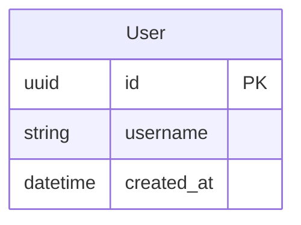

**预期迁移操作**:
```yaml
operations:
  - type: CreateTable
    table_name: user
    columns:
      - name: id
        type: uuid
        primary_key: true
        nullable: false
      - name: username
        type: string
        max_length: 255
        nullable: false
      - name: created_at
        type: datetime
        nullable: false
```

**测试代码**:
```python
def test_create_single_table(tmp_path):
    """T-001: 测试创建单表"""
    er_content = """
    erDiagram
        User {
            uuid id PK
            string username
            datetime created_at
        }
    """
    
    parser = MermaidAntlrParser()
    er_model = parser.parse(er_content)
    
    generator = MigrationGenerator()
    migration = generator.generate(
        namespace="test",
        current_er=er_model,
        migrations_dir=str(tmp_path)
    )
    
    assert migration is not None
    assert len(migration.operations) == 1
    assert isinstance(migration.operations[0], CreateTable)
    assert migration.operations[0].table_name == "user"
    assert len(migration.operations[0].columns) == 3
```

---

### T-002: 删除表

**目标**: 验证系统能够检测并生成删除表的操作

**初始状态**:
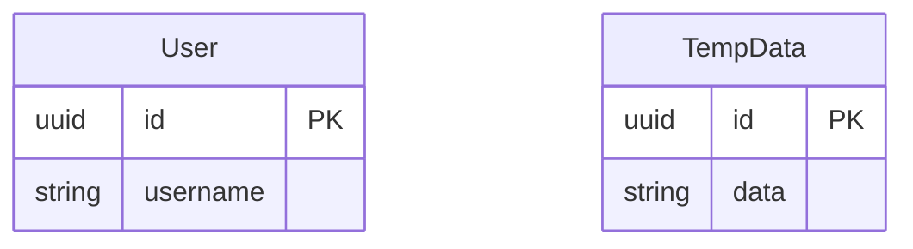

**目标状态**:
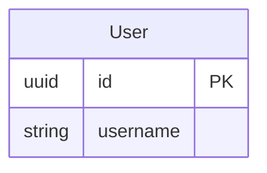

**预期迁移操作**:
```yaml
operations:
  - type: DropTable
    table_name: temp_data
```

**测试代码**:
```python
def test_drop_table(tmp_path):
    """T-002: 测试删除表"""
    # 创建初始状态
    old_er = create_er_model([
        Entity("user", [Column("id", "uuid", is_pk=True), Column("username", "string")]),
        Entity("temp_data", [Column("id", "uuid", is_pk=True), Column("data", "string")])
    ])
    
    # 创建目标状态（删除temp_data表）
    new_er = create_er_model([
        Entity("user", [Column("id", "uuid", is_pk=True), Column("username", "string")])
    ])
    
    differ = ERDiffer()
    operations = differ.diff(old_er, new_er)
    
    assert len(operations) == 1
    assert isinstance(operations[0], DropTable)
    assert operations[0].table_name == "temp_data"
```

---

### T-003: 重命名表

**目标**: 验证系统能够检测表重命名操作

**初始状态**:
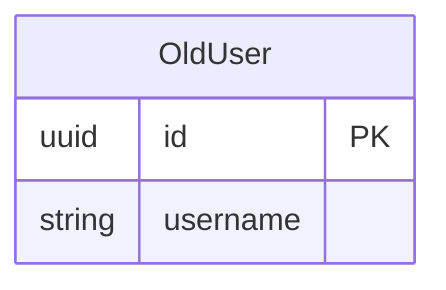

**目标状态**:


**预期迁移操作**:
```yaml
operations:
  - type: RenameTable
    old_name: old_user
    new_name: new_user
```

**测试代码**:
```python
def test_rename_table(tmp_path):
    """T-003: 测试重命名表"""
    old_er = create_er_model([
        Entity("old_user", [Column("id", "uuid", is_pk=True), Column("username", "string")])
    ])
    
    new_er = create_er_model([
        Entity("new_user", [Column("id", "uuid", is_pk=True), Column("username", "string")])
    ])
    
    differ = ERDiffer()
    operations = differ.diff(old_er, new_er)
    
    # 注意：重命名检测需要启发式算法，可能检测为Drop+Create
    # 如果列结构完全相同，应该检测为Rename
    assert len(operations) >= 1
    # 可以是RenameTable或者DropTable+CreateTable组合
```

---

## 2. 列操作 (Column Operations)

### C-001: 添加列（可空）

**目标**: 验证系统能够向现有表添加可空列

**初始状态**:


**目标状态**:
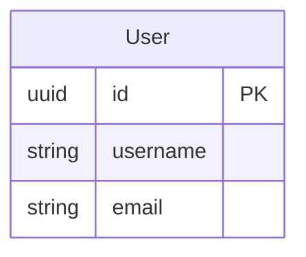

**预期迁移操作**:
```yaml
operations:
  - type: AddColumn
    table_name: user
    column:
      name: email
      type: string
      max_length: 255
      nullable: true
```

**测试代码**:
```python
def test_add_nullable_column(tmp_path):
    """C-001: 测试添加可空列"""
    old_er = create_er_model([
        Entity("user", [
            Column("id", "uuid", is_pk=True),
            Column("username", "string")
        ])
    ])
    
    new_er = create_er_model([
        Entity("user", [
            Column("id", "uuid", is_pk=True),
            Column("username", "string"),
            Column("email", "string", nullable=True)
        ])
    ])
    
    differ = ERDiffer()
    operations = differ.diff(old_er, new_er)
    
    assert len(operations) == 1
    assert isinstance(operations[0], AddColumn)
    assert operations[0].table_name == "user"
    assert operations[0].column.name == "email"
    assert operations[0].column.nullable == True
```

---

### C-002: 添加列（带默认值）

**目标**: 验证系统能够添加带默认值的非空列

**初始状态**:
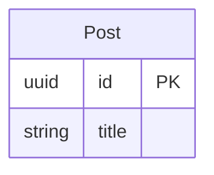

**目标状态**:
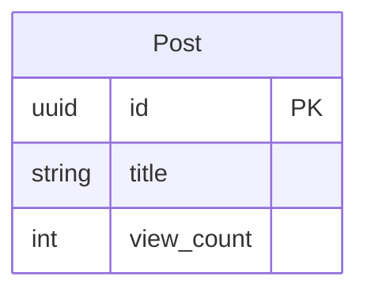

**预期迁移操作**:
```yaml
operations:
  - type: AddColumn
    table_name: post
    column:
      name: view_count
      type: int
      default: 0
      nullable: false
```

**测试代码**:
```python
def test_add_column_with_default(tmp_path):
    """C-002: 测试添加带默认值的列"""
    old_er = create_er_model([
        Entity("post", [
            Column("id", "uuid", is_pk=True),
            Column("title", "string")
        ])
    ])
    
    new_er = create_er_model([
        Entity("post", [
            Column("id", "uuid", is_pk=True),
            Column("title", "string"),
            Column("view_count", "int", default=0, nullable=False)
        ])
    ])
    
    differ = ERDiffer()
    operations = differ.diff(old_er, new_er)
    
    assert len(operations) == 1
    assert isinstance(operations[0], AddColumn)
    assert operations[0].column.name == "view_count"
    assert operations[0].column.default == 0
    assert operations[0].column.nullable == False
```

---

### C-003: 删除列

**目标**: 验证系统能够检测并生成删除列的操作

**初始状态**:
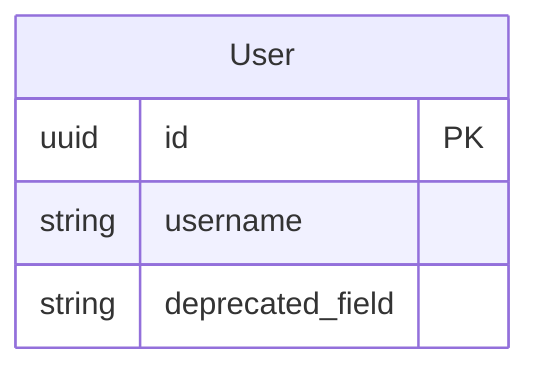

**目标状态**:


**预期迁移操作**:
```yaml
operations:
  - type: RemoveColumn
    table_name: user
    column_name: deprecated_field
```

**测试代码**:
```python
def test_remove_column(tmp_path):
    """C-003: 测试删除列"""
    old_er = create_er_model([
        Entity("user", [
            Column("id", "uuid", is_pk=True),
            Column("username", "string"),
            Column("deprecated_field", "string")
        ])
    ])
    
    new_er = create_er_model([
        Entity("user", [
            Column("id", "uuid", is_pk=True),
            Column("username", "string")
        ])
    ])
    
    differ = ERDiffer()
    operations = differ.diff(old_er, new_er)
    
    assert len(operations) == 1
    assert isinstance(operations[0], RemoveColumn)
    assert operations[0].table_name == "user"
    assert operations[0].column_name == "deprecated_field"
```

---

### C-004: 重命名列

**目标**: 验证系统能够检测列重命名操作

**初始状态**:
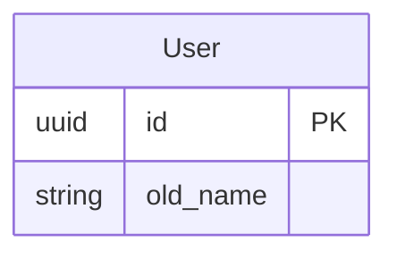

**目标状态**:
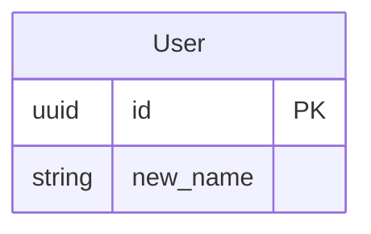

**预期迁移操作**:
```yaml
operations:
  - type: RenameColumn
    table_name: user
    old_name: old_name
    new_name: new_name
```

**测试代码**:
```python
def test_rename_column(tmp_path):
    """C-004: 测试重命名列"""
    old_er = create_er_model([
        Entity("user", [
            Column("id", "uuid", is_pk=True),
            Column("old_name", "string")
        ])
    ])
    
    new_er = create_er_model([
        Entity("user", [
            Column("id", "uuid", is_pk=True),
            Column("new_name", "string")
        ])
    ])
    
    differ = ERDiffer()
    operations = differ.diff(old_er, new_er)
    
    # 重命名检测可能需要启发式算法
    # 可能检测为Remove+Add或者RenameColumn
    assert len(operations) >= 1
```

---

### C-005: 修改列类型

**目标**: 验证系统能够检测列类型变更

**初始状态**:
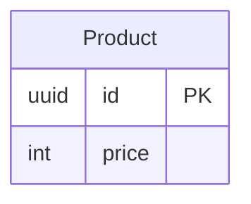

**目标状态**:
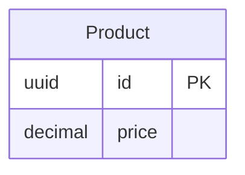

**预期迁移操作**:
```yaml
operations:
  - type: AlterColumn
    table_name: product
    column_name: price
    new_type: decimal
```

**测试代码**:
```python
def test_alter_column_type(tmp_path):
    """C-005: 测试修改列类型"""
    old_er = create_er_model([
        Entity("product", [
            Column("id", "uuid", is_pk=True),
            Column("price", "int")
        ])
    ])
    
    new_er = create_er_model([
        Entity("product", [
            Column("id", "uuid", is_pk=True),
            Column("price", "decimal")
        ])
    ])
    
    differ = ERDiffer()
    operations = differ.diff(old_er, new_er)
    
    assert len(operations) == 1
    assert isinstance(operations[0], AlterColumn)
    assert operations[0].table_name == "product"
    assert operations[0].column_name == "price"
    assert operations[0].new_type == "decimal"
```

---

### C-006: 修改字符串长度

**目标**: 验证系统能够检测字符串字段长度变更

**初始状态**: User表username长度为100
**目标状态**: User表username长度为200

**预期迁移操作**:
```yaml
operations:
  - type: AlterColumn
    table_name: user
    column_name: username
    new_max_length: 200
```

**测试代码**:
```python
def test_alter_string_length(tmp_path):
    """C-006: 测试修改字符串长度"""
    old_er = create_er_model([
        Entity("user", [
            Column("id", "uuid", is_pk=True),
            Column("username", "string", max_length=100)
        ])
    ])
    
    new_er = create_er_model([
        Entity("user", [
            Column("id", "uuid", is_pk=True),
            Column("username", "string", max_length=200)
        ])
    ])
    
    differ = ERDiffer()
    operations = differ.diff(old_er, new_er)
    
    assert len(operations) == 1
    assert isinstance(operations[0], AlterColumn)
    assert operations[0].column_name == "username"
    assert operations[0].new_max_length == 200
```

---

### C-007: 修改可空性

**目标**: 验证系统能够检测列可空性变更

**初始状态**: email可空
**目标状态**: email不可空

**预期迁移操作**:
```yaml
operations:
  - type: AlterColumn
    table_name: user
    column_name: email
    new_nullable: false
```

**测试代码**:
```python
def test_alter_nullable(tmp_path):
    """C-007: 测试修改可空性"""
    old_er = create_er_model([
        Entity("user", [
            Column("id", "uuid", is_pk=True),
            Column("email", "string", nullable=True)
        ])
    ])
    
    new_er = create_er_model([
        Entity("user", [
            Column("id", "uuid", is_pk=True),
            Column("email", "string", nullable=False)
        ])
    ])
    
    differ = ERDiffer()
    operations = differ.diff(old_er, new_er)
    
    assert len(operations) == 1
    assert isinstance(operations[0], AlterColumn)
    assert operations[0].new_nullable == False
```

---

## 3. 索引操作 (Index Operations)

### I-001: 添加单列索引

**目标**: 验证系统能够添加单列索引

**初始状态**:
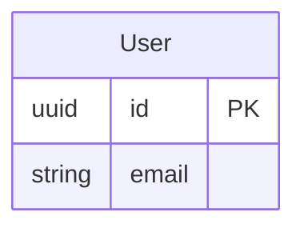

**目标状态**: email字段添加索引

**预期迁移操作**:
```yaml
operations:
  - type: AddIndex
    table_name: user
    index:
      name: idx_user_email
      columns: [email]
      unique: false
```

**测试代码**:
```python
def test_add_single_column_index(tmp_path):
    """I-001: 测试添加单列索引"""
    old_er = create_er_model([
        Entity("user", [
            Column("id", "uuid", is_pk=True),
            Column("email", "string")
        ])
    ])
    
    new_er = create_er_model([
        Entity("user", [
            Column("id", "uuid", is_pk=True),
            Column("email", "string", indexed=True)
        ])
    ])
    
    differ = ERDiffer()
    operations = differ.diff(old_er, new_er)
    
    assert len(operations) == 1
    assert isinstance(operations[0], AddIndex)
    assert operations[0].table_name == "user"
    assert operations[0].index.columns == ["email"]
```

---

### I-002: 添加复合索引

**目标**: 验证系统能够添加多列复合索引

**初始状态**:
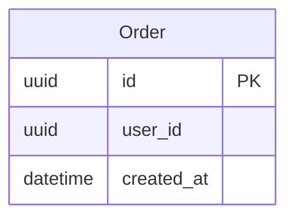

**目标状态**: user_id和created_at组成复合索引

**预期迁移操作**:
```yaml
operations:
  - type: AddIndex
    table_name: order
    index:
      name: idx_order_user_created
      columns: [user_id, created_at]
      unique: false
```

**测试代码**:
```python
def test_add_composite_index(tmp_path):
    """I-002: 测试添加复合索引"""
    old_er = create_er_model([
        Entity("order", [
            Column("id", "uuid", is_pk=True),
            Column("user_id", "uuid"),
            Column("created_at", "datetime")
        ])
    ])
    
    new_er = create_er_model([
        Entity("order", [
            Column("id", "uuid", is_pk=True),
            Column("user_id", "uuid"),
            Column("created_at", "datetime")
        ], indexes=[Index(["user_id", "created_at"])])
    ])
    
    differ = ERDiffer()
    operations = differ.diff(old_er, new_er)
    
    assert len(operations) == 1
    assert isinstance(operations[0], AddIndex)
    assert len(operations[0].index.columns) == 2
```

---

### I-003: 删除索引

**目标**: 验证系统能够删除索引

**初始状态**: email字段有索引
**目标状态**: email字段无索引

**预期迁移操作**:
```yaml
operations:
  - type: RemoveIndex
    table_name: user
    index_name: idx_user_email
```

**测试代码**:
```python
def test_remove_index(tmp_path):
    """I-003: 测试删除索引"""
    old_er = create_er_model([
        Entity("user", [
            Column("id", "uuid", is_pk=True),
            Column("email", "string", indexed=True)
        ])
    ])
    
    new_er = create_er_model([
        Entity("user", [
            Column("id", "uuid", is_pk=True),
            Column("email", "string")
        ])
    ])
    
    differ = ERDiffer()
    operations = differ.diff(old_er, new_er)
    
    assert len(operations) == 1
    assert isinstance(operations[0], RemoveIndex)
    assert operations[0].table_name == "user"
```

---

### I-004: 添加唯一索引

**目标**: 验证系统能够添加唯一约束索引

**初始状态**:


**目标状态**:
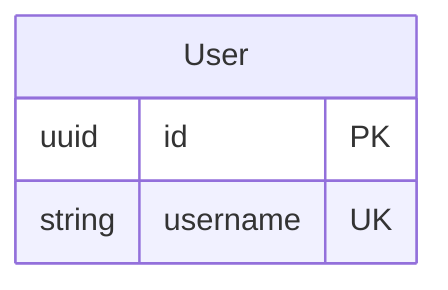

**预期迁移操作**:
```yaml
operations:
  - type: AddIndex
    table_name: user
    index:
      name: idx_user_username_unique
      columns: [username]
      unique: true
```

**测试代码**:
```python
def test_add_unique_index(tmp_path):
    """I-004: 测试添加唯一索引"""
    old_er = create_er_model([
        Entity("user", [
            Column("id", "uuid", is_pk=True),
            Column("username", "string")
        ])
    ])
    
    new_er = create_er_model([
        Entity("user", [
            Column("id", "uuid", is_pk=True),
            Column("username", "string", unique=True)
        ])
    ])
    
    differ = ERDiffer()
    operations = differ.diff(old_er, new_er)
    
    assert len(operations) == 1
    assert isinstance(operations[0], AddIndex)
    assert operations[0].index.unique == True
```

---

## 4. 约束操作 (Constraint Operations)

### K-001: 添加外键约束

**目标**: 验证系统能够添加外键约束

**初始状态**:
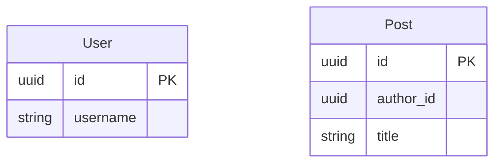

**目标状态**:
```mermaid
erDiagram
    User {
        uuid id PK
        string username
    }
    Post {
        uuid id PK
        uuid author_id FK
        string title
    }
    User ||--o{ Post : writes
```

**预期迁移操作**:
```yaml
operations:
  - type: AddForeignKey
    table_name: post
    foreign_key:
      column_name: author_id
      reference_table: user
      reference_column: id
      on_delete: CASCADE
      on_update: CASCADE
```

**测试代码**:
```python
def test_add_foreign_key(tmp_path):
    """K-001: 测试添加外键约束"""
    old_er = create_er_model([
        Entity("user", [Column("id", "uuid", is_pk=True), Column("username", "string")]),
        Entity("post", [Column("id", "uuid", is_pk=True), Column("author_id", "uuid"), Column("title", "string")])
    ])
    
    new_er = create_er_model([
        Entity("user", [Column("id", "uuid", is_pk=True), Column("username", "string")]),
        Entity("post", [Column("id", "uuid", is_pk=True), Column("author_id", "uuid", is_fk=True), Column("title", "string")])
    ])
    new_er.add_relationship(Relationship("post", "author_id", "user", "id", "CASCADE"))
    
    differ = ERDiffer()
    operations = differ.diff(old_er, new_er)
    
    assert any(isinstance(op, AddForeignKey) for op in operations)
    fk_op = next(op for op in operations if isinstance(op, AddForeignKey))
    assert fk_op.table_name == "post"
    assert fk_op.foreign_key.column_name == "author_id"
    assert fk_op.foreign_key.reference_table == "user"
```

---

### K-002: 删除外键约束

**目标**: 验证系统能够删除外键约束

**初始状态**: Post表的author_id有外键约束
**目标状态**: Post表的author_id无外键约束

**预期迁移操作**:
```yaml
operations:
  - type: RemoveForeignKey
    table_name: post
    constraint_name: fk_post_author_id
```

**测试代码**:
```python
def test_remove_foreign_key(tmp_path):
    """K-002: 测试删除外键约束"""
    old_er = create_er_model([
        Entity("user", [Column("id", "uuid", is_pk=True)]),
        Entity("post", [Column("id", "uuid", is_pk=True), Column("author_id", "uuid", is_fk=True)])
    ])
    old_er.add_relationship(Relationship("post", "author_id", "user", "id"))
    
    new_er = create_er_model([
        Entity("user", [Column("id", "uuid", is_pk=True)]),
        Entity("post", [Column("id", "uuid", is_pk=True), Column("author_id", "uuid")])
    ])
    
    differ = ERDiffer()
    operations = differ.diff(old_er, new_er)
    
    assert any(isinstance(op, RemoveForeignKey) for op in operations)
```

---

### K-003: 修改外键删除行为

**目标**: 验证系统能够修改外键的on_delete行为

**初始状态**: on_delete=CASCADE
**目标状态**: on_delete=SET_NULL

**预期迁移操作**:
```yaml
operations:
  - type: AlterForeignKey
    table_name: post
    constraint_name: fk_post_author_id
    new_on_delete: SET_NULL
```

**测试代码**:
```python
def test_alter_foreign_key_on_delete(tmp_path):
    """K-003: 测试修改外键删除行为"""
    old_er = create_er_model([
        Entity("user", [Column("id", "uuid", is_pk=True)]),
        Entity("post", [Column("id", "uuid", is_pk=True), Column("author_id", "uuid", is_fk=True)])
    ])
    old_er.add_relationship(Relationship("post", "author_id", "user", "id", on_delete="CASCADE"))
    
    new_er = create_er_model([
        Entity("user", [Column("id", "uuid", is_pk=True)]),
        Entity("post", [Column("id", "uuid", is_pk=True), Column("author_id", "uuid", is_fk=True)])
    ])
    new_er.add_relationship(Relationship("post", "author_id", "user", "id", on_delete="SET_NULL"))
    
    differ = ERDiffer()
    operations = differ.diff(old_er, new_er)
    
    # 可能检测为Remove+Add或者AlterForeignKey
    assert len(operations) >= 1
```

---

## 5. 关系操作 (Relationship Operations)

### R-001: 添加一对多关系

**目标**: 验证系统能够处理一对多关系

**输入ER图**:
```mermaid
erDiagram
    User {
        uuid id PK
        string username
    }
    Post {
        uuid id PK
        uuid author_id FK
        string title
    }
    User ||--o{ Post : writes
```

**预期迁移操作**:
```yaml
operations:
  - type: CreateTable
    table_name: user
    columns: [...]
  - type: CreateTable
    table_name: post
    columns: [...]
  - type: AddForeignKey
    table_name: post
    foreign_key:
      column_name: author_id
      reference_table: user
      reference_column: id
```

**测试代码**:
```python
def test_one_to_many_relationship(tmp_path):
    """R-001: 测试一对多关系"""
    er_content = """
    erDiagram
        User {
            uuid id PK
            string username
        }
        Post {
            uuid id PK
            uuid author_id FK
            string title
        }
        User ||--o{ Post : writes
    """
    
    parser = MermaidAntlrParser()
    er_model = parser.parse(er_content)
    
    generator = MigrationGenerator()
    migration = generator.generate("test", er_model, str(tmp_path))
    
    # 应该有2个CreateTable和1个AddForeignKey
    assert len([op for op in migration.operations if isinstance(op, CreateTable)]) == 2
    assert len([op for op in migration.operations if isinstance(op, AddForeignKey)]) == 1
```

---

### R-002: 添加多对多关系

**目标**: 验证系统能够处理多对多关系（通过中间表）

**输入ER图**:
```mermaid
erDiagram
    User {
        uuid id PK
        string username
    }
    Tag {
        uuid id PK
        string name
    }
    UserTag {
        uuid user_id FK
        uuid tag_id FK
    }
    User ||--o{ UserTag : has
    Tag ||--o{ UserTag : has
```

**预期迁移操作**:
```yaml
operations:
  - type: CreateTable
    table_name: user
    columns: [...]
  - type: CreateTable
    table_name: tag
    columns: [...]
  - type: CreateTable
    table_name: user_tag
    columns: [...]
  - type: AddForeignKey
    table_name: user_tag
    foreign_key:
      column_name: user_id
      reference_table: user
      reference_column: id
  - type: AddForeignKey
    table_name: user_tag
    foreign_key:
      column_name: tag_id
      reference_table: tag
      reference_column: id
```

**测试代码**:
```python
def test_many_to_many_relationship(tmp_path):
    """R-002: 测试多对多关系"""
    er_content = """
    erDiagram
        User {
            uuid id PK
            string username
        }
        Tag {
            uuid id PK
            string name
        }
        UserTag {
            uuid user_id FK
            uuid tag_id FK
        }
        User ||--o{ UserTag : has
        Tag ||--o{ UserTag : has
    """
    
    parser = MermaidAntlrParser()
    er_model = parser.parse(er_content)
    
    generator = MigrationGenerator()
    migration = generator.generate("test", er_model, str(tmp_path))
    
    # 应该有3个CreateTable和2个AddForeignKey
    assert len([op for op in migration.operations if isinstance(op, CreateTable)]) == 3
    assert len([op for op in migration.operations if isinstance(op, AddForeignKey)]) == 2
```

---

### R-003: 跨命名空间外键

**目标**: 验证系统能够处理跨命名空间的外键关系

**命名空间auth的ER图**:
```mermaid
erDiagram
    User {
        uuid id PK
        string username
    }
```

**命名空间blog的ER图**:
```mermaid
erDiagram
    Post {
        uuid id PK
        uuid author_id FK
        string title
    }
```

**预期迁移操作** (blog命名空间):
```yaml
version: "1.0"
name: "initial"
namespace: "blog"
dependencies: ["auth.0001_initial"]
operations:
  - type: CreateTable
    table_name: post
    columns: [...]
  - type: AddForeignKey
    table_name: post
    foreign_key:
      column_name: author_id
      reference_table: auth.user
      reference_column: id
```

**测试代码**:
```python
def test_cross_namespace_foreign_key(tmp_path):
    """R-003: 测试跨命名空间外键"""
    # 创建auth命名空间的User表
    auth_er = create_er_model([
        Entity("user", [Column("id", "uuid", is_pk=True), Column("username", "string")])
    ])
    
    generator = MigrationGenerator()
    auth_migration = generator.generate("auth", auth_er, str(tmp_path))
    
    file_manager = FileManager(str(tmp_path))
    file_manager.save_migration(auth_migration)
    
    # 创建blog命名空间的Post表，引用auth.user
    blog_er = create_er_model([
        Entity("post", [Column("id", "uuid", is_pk=True), Column("author_id", "uuid", is_fk=True), Column("title", "string")])
    ])
    blog_er.add_cross_namespace_relationship("post", "author_id", "auth", "user", "id")
    
    blog_migration = generator.generate("blog", blog_er, str(tmp_path))
    
    # 验证依赖关系
    assert "auth.0001_initial" in blog_migration.dependencies
    
    # 验证外键引用
    fk_ops = [op for op in blog_migration.operations if isinstance(op, AddForeignKey)]
    assert len(fk_ops) == 1
    assert fk_ops[0].foreign_key.reference_table == "auth.user"
```

---

## 6. 系统操作 (System Operations)

### S-001: 状态重建

**目标**: 验证系统能够从迁移历史重建完整的ER状态

**迁移历史**:
1. 0001_initial.yaml: 创建User表
2. 0002_add_email.yaml: 给User表添加email列
3. 0003_add_index.yaml: 给email添加索引

**测试代码**:
```python
def test_rebuild_state_from_migrations(tmp_path):
    """S-001: 测试状态重建"""
    # 创建迁移历史
    migrations = [
        Migration(
            name="initial",
            namespace="test",
            dependencies=[],
            operations=[
                CreateTable("user", [
                    Column("id", "uuid", is_pk=True),
                    Column("username", "string")
                ])
            ]
        ),
        Migration(
            name="add_email",
            namespace="test",
            dependencies=["test.0001_initial"],
            operations=[
                AddColumn("user", Column("email", "string"))
            ]
        ),
        Migration(
            name="add_index",
            namespace="test",
            dependencies=["test.0002_add_email"],
            operations=[
                AddIndex("user", Index(["email"]))
            ]
        )
    ]
    
    # 重建状态
    builder = StateBuilder()
    rebuilt_model = builder.build_state(migrations)
    
    # 验证重建的模型
    assert "user" in rebuilt_model.entities
    user_entity = rebuilt_model.entities["user"]
    
    # 验证列
    column_names = {col.name for col in user_entity.columns}
    assert column_names == {"id", "username", "email"}
    
    # 验证索引
    assert len(user_entity.indexes) == 1
    assert user_entity.indexes[0].columns == ["email"]
```

---

### S-002: 依赖解析

**目标**: 验证系统能够正确解析和排序迁移依赖

**迁移依赖图**:
```
auth.0001_initial
  ↓
blog.0001_initial (depends on auth.0001_initial)
  ↓
blog.0002_add_comments (depends on blog.0001_initial)
```

**测试代码**:
```python
def test_dependency_resolution(tmp_path):
    """S-002: 测试依赖解析"""
    migrations = [
        Migration(
            name="add_comments",
            namespace="blog",
            dependencies=["blog.0001_initial"],
            operations=[]
        ),
        Migration(
            name="initial",
            namespace="blog",
            dependencies=["auth.0001_initial"],
            operations=[]
        ),
        Migration(
            name="initial",
            namespace="auth",
            dependencies=[],
            operations=[]
        )
    ]
    
    # 解析依赖并排序
    resolver = DependencyResolver()
    sorted_migrations = resolver.resolve(migrations)
    
    # 验证排序结果
    assert sorted_migrations[0].namespace == "auth"
    assert sorted_migrations[1].namespace == "blog" and sorted_migrations[1].name == "initial"
    assert sorted_migrations[2].namespace == "blog" and sorted_migrations[2].name == "add_comments"
```

---

### S-003: 循环依赖检测

**目标**: 验证系统能够检测并报告循环依赖

**迁移依赖图**:
```
blog.0001 → blog.0002 → blog.0001 (循环!)
```

**测试代码**:
```python
def test_circular_dependency_detection(tmp_path):
    """S-003: 测试循环依赖检测"""
    migrations = [
        Migration(
            name="m1",
            namespace="blog",
            dependencies=["blog.0002_m2"],
            operations=[]
        ),
        Migration(
            name="m2",
            namespace="blog",
            dependencies=["blog.0001_m1"],
            operations=[]
        )
    ]
    
    resolver = DependencyResolver()
    
    with pytest.raises(DependencyError, match="Circular dependency"):
        resolver.resolve(migrations)
```

---

### S-004: 空变更检测

**目标**: 验证系统能够检测没有变更的情况

**测试代码**:
```python
def test_no_changes_detected(tmp_path):
    """S-004: 测试空变更检测"""
    # 创建初始迁移
    er_model = create_er_model([
        Entity("user", [Column("id", "uuid", is_pk=True), Column("username", "string")])
    ])
    
    generator = MigrationGenerator()
    migration1 = generator.generate("test", er_model, str(tmp_path))
    
    file_manager = FileManager(str(tmp_path))
    file_manager.save_migration(migration1)
    
    # 使用相同的ER图再次生成
    migration2 = generator.generate("test", er_model, str(tmp_path))
    
    # 应该返回None（没有变更）
    assert migration2 is None
```

---

### S-005: 迁移文件命名

**目标**: 验证系统能够正确生成迁移文件名

**测试代码**:
```python
def test_migration_file_naming(tmp_path):
    """S-005: 测试迁移文件命名"""
    # 创建第一个迁移
    er1 = create_er_model([Entity("user", [Column("id", "uuid", is_pk=True)])])
    generator = MigrationGenerator()
    migration1 = generator.generate("test", er1, str(tmp_path))
    
    file_manager = FileManager(str(tmp_path))
    file_manager.save_migration(migration1)
    
    # 验证文件名
    migration_file = tmp_path / "test" / "0001_initial.yaml"
    assert migration_file.exists()
    
    # 创建第二个迁移
    er2 = create_er_model([
        Entity("user", [Column("id", "uuid", is_pk=True), Column("email", "string")])
    ])
    migration2 = generator.generate("test", er2, str(tmp_path))
    file_manager.save_migration(migration2)
    
    # 验证第二个文件名
    migration_file2 = tmp_path / "test" / "0002_add_email.yaml"
    assert migration_file2.exists()
```

---

## 7. 扩展性测试 (Extensibility Tests)

### E-001: 自定义ER标准支持

**目标**: 验证系统能够通过配置支持自定义ER图标准

**场景**: 用户的ER图使用自定义注释来表示索引

**自定义ER图**:
```mermaid
erDiagram
    User {
        uuid id PK
        string email "@index"
        string username "@unique"
    }
```

**配置文件** (er_config.yaml):
```yaml
custom_annotations:
  index_marker: "@index"
  unique_marker: "@unique"
  foreign_key_marker: "@fk"
```

**测试代码**:
```python
def test_custom_er_standard(tmp_path):
    """E-001: 测试自定义ER标准支持"""
    # 加载自定义配置
    config = ERConfig.load(tmp_path / "er_config.yaml")
    
    # 解析使用自定义标准的ER图
    parser = MermaidAntlrParser(config=config)
    er_model = parser.parse(custom_er_content)
    
    # 验证解析结果
    user_entity = er_model.entities["user"]
    email_col = next(col for col in user_entity.columns if col.name == "email")
    username_col = next(col for col in user_entity.columns if col.name == "username")
    
    assert email_col.indexed == True
    assert username_col.unique == True
```

---

### E-002: 自定义类型映射

**目标**: 验证系统能够支持自定义数据类型映射

**场景**: 用户需要将自定义类型映射到数据库类型

**配置文件** (type_mapping.yaml):
```yaml
custom_types:
  phone_number:
    base_type: string
    max_length: 20
    pattern: "^\\+?[1-9]\\d{1,14}$"
  email_address:
    base_type: string
    max_length: 255
    pattern: "^[a-zA-Z0-9._%+-]+@[a-zA-Z0-9.-]+\\.[a-zA-Z]{2,}$"
```

**测试代码**:
```python
def test_custom_type_mapping(tmp_path):
    """E-002: 测试自定义类型映射"""
    # 加载自定义类型映射
    type_mapper = TypeMapper.load(tmp_path / "type_mapping.yaml")
    
    # 创建使用自定义类型的ER模型
    er_model = create_er_model([
        Entity("user", [
            Column("id", "uuid", is_pk=True),
            Column("phone", "phone_number"),
            Column("email", "email_address")
        ])
    ])
    
    # 生成迁移
    generator = MigrationGenerator(type_mapper=type_mapper)
    migration = generator.generate("test", er_model, str(tmp_path))
    
    # 验证类型映射
    create_table_op = migration.operations[0]
    phone_col = next(col for col in create_table_op.columns if col.name == "phone")
    email_col = next(col for col in create_table_op.columns if col.name == "email")
    
    assert phone_col.type == "string"
    assert phone_col.max_length == 20
    assert email_col.type == "string"
    assert email_col.max_length == 255
```

---

### E-003: 自定义操作类型

**目标**: 验证系统能够支持用户自定义的迁移操作类型

**场景**: 用户需要添加数据库特定的操作（如PostgreSQL的ENUM类型）

**自定义操作定义**:
```python
class CreateEnumType(Operation):
    """创建枚举类型（PostgreSQL特定）"""
    def __init__(self, name: str, values: List[str]):
        self.name = name
        self.values = values
    
    def to_dict(self) -> dict:
        return {
            "type": "CreateEnumType",
            "name": self.name,
            "values": self.values
        }
```

**测试代码**:
```python
def test_custom_operation_type(tmp_path):
    """E-003: 测试自定义操作类型"""
    # 注册自定义操作类型
    OperationRegistry.register("CreateEnumType", CreateEnumType)
    
    # 创建包含自定义操作的迁移
    migration = Migration(
        name="add_enum",
        namespace="test",
        dependencies=[],
        operations=[
            CreateEnumType("user_status", ["active", "inactive", "suspended"])
        ]
    )
    
    # 保存迁移
    file_manager = FileManager(str(tmp_path))
    file_manager.save_migration(migration)
    
    # 加载并验证
    loaded_migration = file_manager.load_migration("test", "0001_add_enum.yaml")
    assert len(loaded_migration.operations) == 1
    assert isinstance(loaded_migration.operations[0], CreateEnumType)
    assert loaded_migration.operations[0].values == ["active", "inactive", "suspended"]
```

---

## 8. CLI测试 (CLI Tests)

### CLI-001: makemigrations命令

**目标**: 验证makemigrations命令能够正确生成迁移文件

**测试代码**:
```python
def test_cli_makemigrations(tmp_path, cli_runner):
    """CLI-001: 测试makemigrations命令"""
    # 准备ER图文件
    er_file = tmp_path / "schema.mmd"
    er_file.write_text("""
    erDiagram
        User {
            uuid id PK
            string username
        }
    """)
    
    # 执行命令
    result = cli_runner.invoke(main, [
        'makemigrations',
        '-n', 'test',
        '-e', str(er_file),
        '--migrations-dir', str(tmp_path / '.migrations')
    ])
    
    # 验证结果
    assert result.exit_code == 0
    assert "Migrations for 'test':" in result.output
    assert "0001_initial.yaml" in result.output
    
    # 验证文件已创建
    migration_file = tmp_path / '.migrations' / 'test' / '0001_initial.yaml'
    assert migration_file.exists()
```

---

### CLI-002: showmigrations命令

**目标**: 验证showmigrations命令能够显示迁移状态

**测试代码**:
```python
def test_cli_showmigrations(tmp_path, cli_runner):
    """CLI-002: 测试showmigrations命令"""
    # 准备迁移文件
    setup_test_migrations(tmp_path, "test", 3)
    
    # 执行命令
    result = cli_runner.invoke(main, [
        'showmigrations',
        '-n', 'test',
        '--migrations-dir', str(tmp_path)
    ])
    
    # 验证输出
    assert result.exit_code == 0
    assert "test" in result.output
    assert "[X] 0001_initial" in result.output
    assert "[X] 0002_" in result.output
    assert "[X] 0003_" in result.output
```

---

### CLI-003: rebuild-state命令

**目标**: 验证rebuild-state命令能够从迁移历史重建ER图

**测试代码**:
```python
def test_cli_rebuild_state(tmp_path, cli_runner):
    """CLI-003: 测试rebuild-state命令"""
    # 准备迁移文件
    setup_test_migrations(tmp_path, "test", 2)
    
    # 执行命令
    output_file = tmp_path / "rebuilt.mmd"
    result = cli_runner.invoke(main, [
        'rebuild-state',
        '-n', 'test',
        '-o', str(output_file),
        '--migrations-dir', str(tmp_path)
    ])
    
    # 验证结果
    assert result.exit_code == 0
    assert output_file.exists()
    
    # 验证生成的ER图内容
    content = output_file.read_text()
    assert "erDiagram" in content
    assert "User" in content
```

---

### CLI-004: 命令行参数验证

**目标**: 验证CLI能够正确处理无效参数

**测试代码**:
```python
def test_cli_invalid_arguments(tmp_path, cli_runner):
    """CLI-004: 测试命令行参数验证"""
    # 测试缺少必需参数
    result = cli_runner.invoke(main, ['makemigrations'])
    assert result.exit_code != 0
    assert "Missing option" in result.output or "required" in result.output.lower()
    
    # 测试无效的文件路径
    result = cli_runner.invoke(main, [
        'makemigrations',
        '-n', 'test',
        '-e', '/nonexistent/file.mmd'
    ])
    assert result.exit_code != 0
    
    # 测试无效的命名空间名称
    result = cli_runner.invoke(main, [
        'makemigrations',
        '-n', 'invalid-namespace!',
        '-e', str(tmp_path / 'schema.mmd')
    ])
    assert result.exit_code != 0
```

---

## 9. 测试辅助函数

```python
# tests/test_er_migrate/conftest.py

import pytest
from pathlib import Path
from x007007007.er_migrate.models import *
from x007007007.er_migrate.differ import ERDiffer
from x007007007.er_migrate.generator import MigrationGenerator
from x007007007.er_migrate.file_manager import FileManager

@pytest.fixture
def cli_runner():
    """Click CLI测试运行器"""
    from click.testing import CliRunner
    return CliRunner()

def create_er_model(entities: List[Entity]) -> ERModel:
    """创建ER模型的辅助函数"""
    model = ERModel()
    for entity in entities:
        model.add_entity(entity)
    return model

def setup_test_migrations(base_dir: Path, namespace: str, count: int):
    """设置测试迁移文件"""
    migrations_dir = base_dir / namespace
    migrations_dir.mkdir(parents=True, exist_ok=True)
    
    for i in range(1, count + 1):
        migration_file = migrations_dir / f"{i:04d}_migration_{i}.yaml"
        migration_file.write_text(f"""
version: "1.0"
name: "migration_{i}"
namespace: "{namespace}"
dependencies: {[f"{namespace}.{j:04d}_migration_{j}" for j in range(1, i)]}
operations: []
""")

def assert_er_models_equal(model1: ERModel, model2: ERModel):
    """断言两个ER模型相等"""
    assert set(model1.entities.keys()) == set(model2.entities.keys())
    
    for entity_name in model1.entities:
        entity1 = model1.entities[entity_name]
        entity2 = model2.entities[entity_name]
        
        columns1 = {col.name: col for col in entity1.columns}
        columns2 = {col.name: col for col in entity2.columns}
        
        assert set(columns1.keys()) == set(columns2.keys())
        
        for col_name in columns1:
            col1 = columns1[col_name]
            col2 = columns2[col_name]
            assert col1.type == col2.type
            assert col1.is_pk == col2.is_pk
            assert col1.nullable == col2.nullable
```

---

## 10. 测试覆盖率目标

- [ ] 数据模型验证 (models.py): 100%
- [ ] Differ算法 (differ.py): >= 95%
- [ ] StateBuilder (state_builder.py): >= 95%
- [ ] FileManager (file_manager.py): >= 90%
- [ ] Generator (generator.py): >= 90%
- [ ] CLI命令 (cli.py): >= 85%
- [ ] 整体覆盖率: >= 90%

---

## 11. 测试执行顺序

建议按以下顺序实现和执行测试：

### Phase 1: 基础模型测试
1. 数据模型验证 (models.py)
2. 文件管理 (file_manager.py)

### Phase 2: 核心算法测试
3. 表操作 (T-001 ~ T-003)
4. 列操作 (C-001 ~ C-007)
5. 索引操作 (I-001 ~ I-004)

### Phase 3: 高级功能测试
6. 约束操作 (K-001 ~ K-003)
7. 关系操作 (R-001 ~ R-003)
8. 系统操作 (S-001 ~ S-005)

### Phase 4: 扩展性和CLI测试
9. 扩展性测试 (E-001 ~ E-003)
10. CLI测试 (CLI-001 ~ CLI-004)

---

## 12. 持续集成配置

```yaml
# .github/workflows/test.yml
name: Test ER Migrations

on: [push, pull_request]

jobs:
  test:
    runs-on: ubuntu-latest
    steps:
      - uses: actions/checkout@v2
      - name: Set up Python
        uses: actions/setup-python@v2
        with:
          python-version: '3.10'
      - name: Install dependencies
        run: |
          pip install uv
          uv pip install -e ".[dev]"
      - name: Run tests
        run: |
          uv run pytest tests/test_er_migrate/ -v --cov=src/x007007007/er_migrate --cov-report=html
      - name: Upload coverage
        uses: codecov/codecov-action@v2
```
