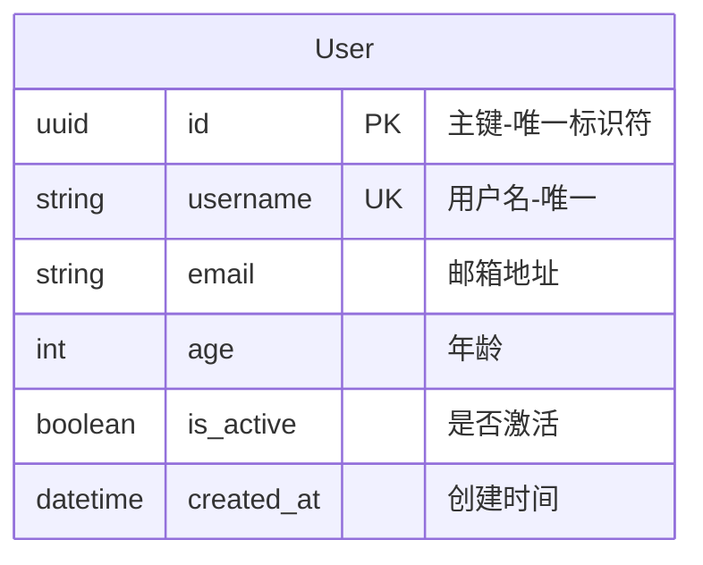
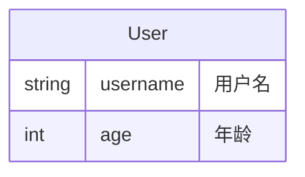
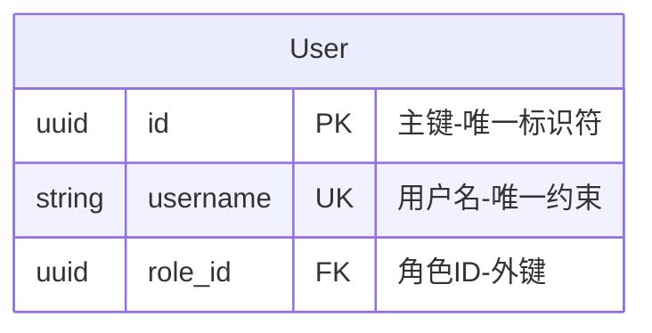
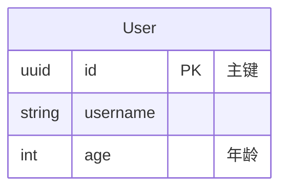

# 列注释功能支持

## 概述

ER迁移系统现在完全支持在Mermaid ER图中为列添加注释。注释使用双引号包裹,支持中文和英文字符。

## 语法



## 特性

- ✅ 支持中文和英文注释
- ✅ 支持特殊字符（冒号、括号、连字符等）
- ✅ 可与PK、FK、UK等修饰符一起使用
- ✅ 注释会被保存到迁移文件中
- ✅ 可选功能 - 列可以有注释也可以没有

## 示例

### 基本用法



### 带修饰符



### 混合使用



## 技术细节

### 问题修复

之前的ANTLR生成的解析器缺少`UK` token定义,导致带有`UK`修饰符的列无法正确解析注释。

**解决方案**:
1. 重新生成ANTLR解析器,确保所有token正确生成
2. 更新`generate_antlr.sh`脚本,同时生成Mermaid和PlantUML解析器
3. 添加内存限制参数(`-Xmx500M`)以确保生成过程稳定

### 语法规则

在`MermaidER.g4`中定义:

```antlr
columnDef: columnType columnName columnModifiers? columnComment?;
columnComment: STRING;
STRING: '"' (~["\r\n] | '\\"')* '"';
```

### 测试覆盖

新增8个测试用例覆盖:
- 英文注释
- 中文注释
- 带PK修饰符的注释
- 带UK修饰符的注释
- 带FK修饰符的注释
- 多个修饰符的注释
- 混合有无注释的列
- 特殊字符注释

## 示例文件

所有示例文件已更新以包含中文注释:

- `examples/blog_v1.mmd` - `examples/blog_v8.mmd`: 博客系统演进示例
- `examples/all_data_types.mmd`: 所有数据类型展示
- `examples/DATA_TYPES.md`: 数据类型文档

## 迁移文件

注释会被保存到YAML迁移文件中:

```yaml
- type: CreateTable
  table_name: user
  columns:
  - name: id
    type: uuid
    primary_key: true
    comment: 主键-唯一标识符
  - name: username
    type: string
    unique: true
    comment: 用户名-唯一
```

## 使用方法

1. 在Mermaid ER图中添加注释:
   ```bash
   vim examples/my_model.mmd
   ```

2. 生成迁移:
   ```bash
   uv run er-migrate makemigrations -n my_app -e examples/my_model.mmd
   ```

3. 查看生成的迁移文件:
   ```bash
   cat .migrations/my_app/0001_initial.yaml
   ```

## 注意事项

- 注释必须使用双引号包裹
- 注释是可选的,不是所有列都需要注释
- 注释支持任何Unicode字符
- 注释会被保留在整个迁移流程中

## 相关文件

- `src/x007007007/er/parser/antlr/MermaidER.g4` - 语法定义
- `src/x007007007/er/parser/antlr/mermaid_antlr_parser.py` - 解析器实现
- `tools/generate_antlr.sh` - ANTLR生成脚本
- `tests/test_column_comments.py` - 注释功能测试
- `examples/DATA_TYPES.md` - 数据类型和注释文档
