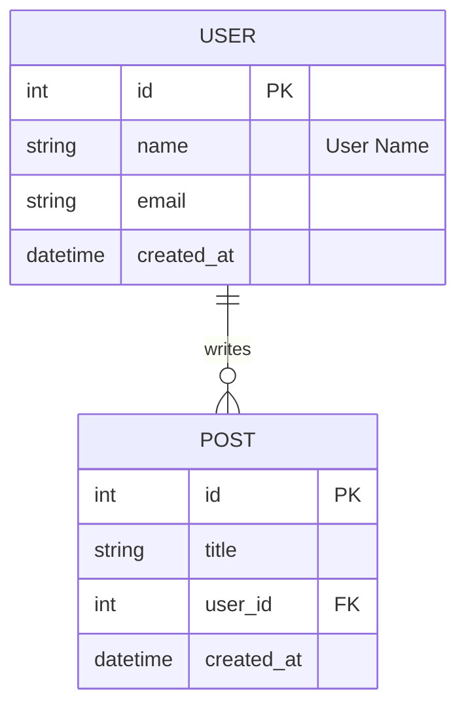
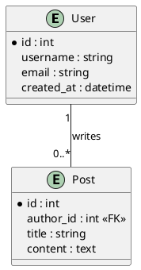

# ER Diagram Converter

一个强大的ER图（实体关系图）转换工具，可以将Mermaid、PlantUML格式的ER图或现有数据库转换为Django和SQLAlchemy ORM模型代码。

## 功能特性

- ✅ 支持多种输入格式：
  - Mermaid ER图（使用 ANTLR4 解析）
  - PlantUML ER图（使用 ANTLR4 解析）
  - 现有数据库（通过SQLAlchemy连接）
- ✅ 支持多种输出格式：
  - Django Models
  - SQLAlchemy Models
  - Mermaid ER图
  - PlantUML ER图
- ✅ **格式互转**：Mermaid ↔ PlantUML 双向转换
- ✅ 自动识别关系类型（一对一、一对多、多对多）
- ✅ 支持外键关系生成
- ✅ 智能类型映射（int, string, datetime, boolean等）
- ✅ 支持字段注释和默认值
- ✅ 支持实体注释和关系标签

## 安装

```bash
# 使用uv安装（推荐）
uv pip install -e .

# 或使用pip
pip install -e .
```

### 生成ANTLR解析器（可选）

如果要使用ANTLR解析器（比正则表达式更强大），需要生成ANTLR代码：

**Windows:**
```bash
tools\generate_antlr.bat
```

**Linux/Mac:**
```bash
chmod +x tools/generate_antlr.sh
./tools/generate_antlr.sh
```

**注意**: 
- 需要Java 11+（ANTLR 4.13.2要求）
- 如果只有Java 8，可以使用ANTLR 4.9.3（需要修改脚本中的JAR文件名）
- **必须生成ANTLR代码才能使用解析器**，项目已移除正则表达式解析器，完全依赖ANTLR4

## 使用方法

### 基本用法

```bash
# 从Mermaid文件转换为Django模型
er-convert convert diagram.mermaid --input-type mermaid --format django

# 从PlantUML文件转换为SQLAlchemy模型
er-convert convert diagram.puml --input-type plantuml --format sqlalchemy

# 从数据库转换为Django模型
er-convert convert "sqlite:///mydb.db" --input-type db --format django

# 指定输出文件
er-convert convert diagram.mermaid -o models.py
```

### 命令行选项

- `input_source`: 输入源（文件路径或数据库URL）
- `--input-type, -t`: 输入类型 (`mermaid`, `plantuml`, `db`)，默认为 `mermaid`
- `--format, -f`: 输出格式 (`django`, `sqlalchemy`, `mermaid`, `plantuml`)，默认为 `django`
- `--output, -o`: 输出文件（默认为标准输出）
- `--app-label, -a`: Django app 标签（默认：文件名不含扩展名）
- `--table-prefix, -p`: 表名前缀（默认：文件名不含扩展名）

## 支持的语法

### Mermaid ER图示例



### PlantUML ER图示例



## 支持的数据类型

- **整数类型**: `int`, `integer`, `bigint`, `smallint`
- **浮点类型**: `float`, `real`, `double`
- **小数类型**: `decimal`, `numeric`
- **布尔类型**: `boolean`, `bool`
- **日期时间**: `date`, `time`, `datetime`, `timestamp`
- **文本类型**: `string`, `varchar`, `char`, `text`, `longtext`
- **JSON类型**: `json`, `jsonb`

## 项目结构

```
ER/
├── src/
│   └── x007007007/
│       └── er/
│           ├── __init__.py
│           ├── base.py          # 基础抽象类
│           ├── cli.py            # 命令行接口
│           ├── models.py         # 数据模型
│           ├── parser/
│           │   └── antlr/
│           │       ├── mermaid_antlr_parser.py  # Mermaid ANTLR解析器
│           │       ├── plantuml_antlr_parser.py # PlantUML ANTLR解析器
│           │       ├── MermaidER.g4            # Mermaid语法定义
│           │       ├── PlantUMLER.g4            # PlantUML语法定义
│           │       └── generated/              # ANTLR生成的代码
│           ├── db_parser.py      # 数据库解析器
│           ├── renderers.py      # 代码渲染器
│           ├── type_mapper.py   # 类型映射器
│           └── templates/       # Jinja2模板
│               ├── django_model.j2
│               └── sqlalchemy_model.j2
├── tests/                       # 测试文件
├── pyproject.toml
└── README.md
```

## 开发

### 运行测试

```bash
# 运行所有测试
pytest tests/

# 运行测试并查看覆盖率
pytest tests/ --cov=src/x007007007/er --cov-report=term-missing
```

### 代码规范

本项目遵循以下代码规范（详见 `.cursorrules`）：

- **禁止滥用 try-except**：只在真正需要处理异常的地方使用
- **使用 assert 进行参数验证**：所有函数参数必须使用 assert 验证
- 使用类型提示（type hints）
- 保持函数单一职责

### 代码覆盖率

当前总体覆盖率：**71%**（包含 ANTLR 生成代码）

核心模块覆盖率：
- `renderers.py`: 100%
- `models.py`: 93%
- `cli.py`: 90%
- `mermaid_antlr_parser.py`: 89%
- `plantuml_antlr_parser.py`: 84%

详细覆盖率报告请参考 `COVERAGE_REPORT.md`。

## 项目状态

### ✅ 已完成的功能

- ✅ **ANTLR4 解析器**：Mermaid 和 PlantUML 都使用 ANTLR4 解析器
- ✅ **完整的数据模型**：支持外键、基数、注释等
- ✅ **类型映射系统**：统一的 TypeMapper 类
- ✅ **ORM 代码生成**：Django 和 SQLAlchemy 完整支持
- ✅ **关系处理**：一对一、一对多、多对多关系完整支持
- ✅ **数据库解析**：支持从现有数据库生成模型
- ✅ **验证逻辑**：ERModel 验证方法
- ✅ **测试覆盖**：37个测试全部通过

### ⚠️ 待改进

- ⚠️ 提高 `db_parser.py` 测试覆盖率（当前 59%）
- ⚠️ 提高 `type_mapper.py` 测试覆盖率（当前 68%）
- ⚠️ 添加更多边界情况测试

详细设计问题分析请参考 `DESIGN_ISSUES.md`。

## 许可证

MIT License

## 贡献

欢迎提交Issue和Pull Request！

