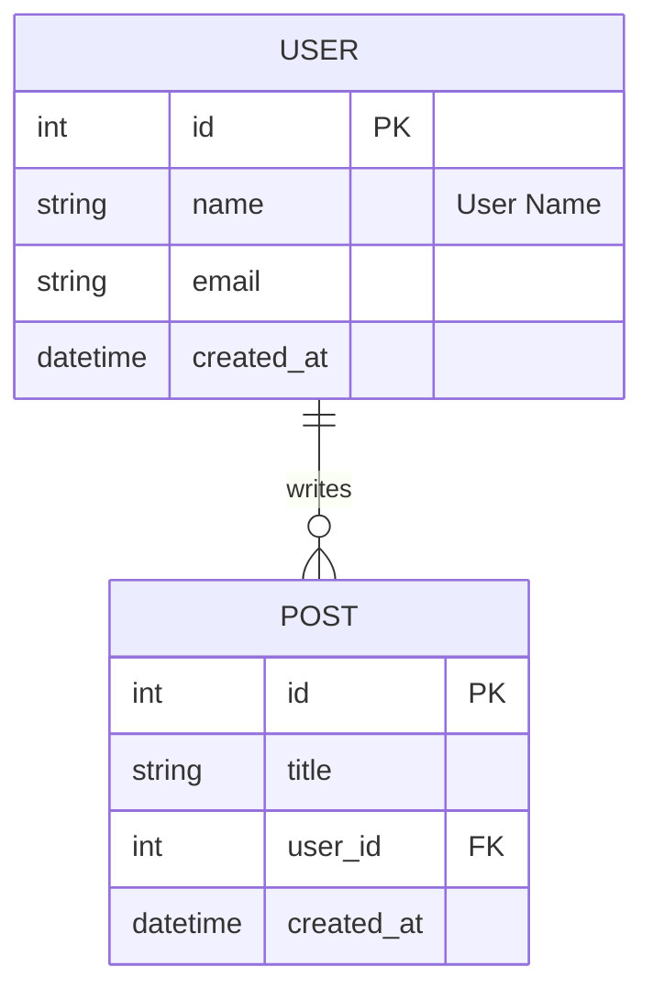
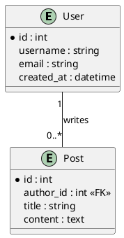

# ER Diagram Converter

一个强大的ER图（实体关系图）转换工具，可以将Mermaid、PlantUML格式的ER图或现有数据库转换为Django和SQLAlchemy ORM模型代码。

## 功能特性

- ✅ 支持多种输入格式：
  - Mermaid ER图（使用 ANTLR4 解析）
  - PlantUML ER图（使用 ANTLR4 解析）
  - TOML ER图（支持模板和继承）
  - 现有数据库（通过SQLAlchemy连接）
- ✅ 支持多种输出格式：
  - Django Models
  - SQLAlchemy Models
  - Mermaid ER图
  - PlantUML ER图
- ✅ **格式互转**：Mermaid ↔ PlantUML 双向转换
- ✅ 自动识别关系类型（一对一、一对多、多对多）
- ✅ 支持外键关系生成
- ✅ 智能类型映射（int, string, datetime, boolean等）
- ✅ 支持字段注释和默认值
- ✅ 支持实体注释和关系标签
- ✅ **MCP 服务器支持**：可在 Cursor 等编辑器中直接使用
- ✅ **AI 建模工具**：使用自然语言生成 ER 图

## 安装

```bash
# 使用uv安装（推荐）
uv pip install -e .

# 或使用pip
pip install -e .
```

### 生成ANTLR解析器

**必须生成ANTLR代码才能使用解析器**，项目已完全依赖ANTLR4：

**Windows:**
```bash
tools\generate_antlr.bat
```

**Linux/Mac:**
```bash
chmod +x tools/generate_antlr.sh
./tools/generate_antlr.sh
```

**注意**: 
- 需要Java 11+（ANTLR 4.13.2要求）
- 如果只有Java 8，可以使用ANTLR 4.9.3（需要修改脚本中的JAR文件名）

## 使用方法

### 基本用法

```bash
# 从Mermaid文件转换为Django模型
er-convert convert diagram.mermaid --input-type mermaid --format django

# 从PlantUML文件转换为SQLAlchemy模型
er-convert convert diagram.puml --input-type plantuml --format sqlalchemy

# 从TOML文件转换为Django模型
er-convert convert diagram.toml --input-type toml --format django

# 从数据库转换为Django模型
er-convert convert "sqlite:///mydb.db" --input-type db --format django

# 指定输出文件
er-convert convert diagram.mermaid -o models.py
```

### 命令行选项

- `input_source`: 输入源（文件路径或数据库URL）
- `--input-type, -t`: 输入类型 (`mermaid`, `plantuml`, `toml`, `db`)，默认为 `mermaid`
- `--format, -f`: 输出格式 (`django`, `sqlalchemy`, `mermaid`, `plantuml`)，默认为 `django`
- `--output, -o`: 输出文件（默认为标准输出）
- `--app-label, -a`: Django app 标签（默认：文件名不含扩展名）
- `--table-prefix, -p`: 表名前缀（默认：文件名不含扩展名）

## 支持的语法

### Mermaid ER图示例



### PlantUML ER图示例



### TOML ER图示例

TOML格式支持模板和继承，可以显著减少重复字段定义：

```toml
# 定义模板
[templates.create_update_time]
columns = [
    {name = "created_at", type = "datetime", comment = "Creation timestamp"},
    {name = "updated_at", type = "datetime", comment = "Update timestamp"},
]

# 实体继承模板
[entities.USER]
extends = ["create_update_time"]
columns = [
    {name = "id", type = "int", is_pk = true},
    {name = "username", type = "string", unique = true},
    {name = "email", type = "string"},
]

# 关系定义
[[relationships]]
left = "USER"
right = "POST"
type = "one-to-many"
left_label = "writes"
```

**TOML格式特性：**
- ✅ 支持模板定义和继承
- ✅ 支持多模板继承
- ✅ 支持字段覆盖
- ✅ 类型明确，语法简单

## 支持的数据类型

- **整数类型**: `int`, `integer`, `bigint`, `smallint`
- **浮点类型**: `float`, `real`, `double`
- **小数类型**: `decimal`, `numeric`
- **布尔类型**: `boolean`, `bool`
- **日期时间**: `date`, `time`, `datetime`, `timestamp`
- **文本类型**: `string`, `varchar`, `char`, `text`, `longtext`
- **JSON类型**: `json`, `jsonb`

## MCP 服务器支持

ER Diagram Converter 支持作为 MCP (Model Context Protocol) 服务器运行，可以直接集成到 Cursor 等支持 MCP 的编辑器中。

### 快速开始（Windows）

#### 使用 pipx（推荐）

1. **安装 pipx**：
   ```powershell
   python -m pip install --user pipx
   python -m pipx ensurepath
   ```

2. **安装项目**：
   ```powershell
   pipx install -e .
   ```

3. **配置 Cursor**：
   
   打开配置文件：`%APPDATA%\Cursor\User\globalStorage\mcp.json`
   
   添加以下内容：
   ```json
   {
     "mcpServers": {
       "er-diagram-converter": {
         "command": "pipx",
         "args": ["run", "er-mcp"]
       }
     }
   }
   ```

4. **重启 Cursor**，完成！

#### 使用虚拟环境

1. **创建虚拟环境**：
   ```powershell
   python -m venv .venv-mcp
   .venv-mcp\Scripts\Activate.ps1
   pip install -e .
   ```

2. **配置 Cursor**：
   ```json
   {
     "mcpServers": {
       "er-diagram-converter": {
         "command": "C:\\path\\to\\ER\\.venv-mcp\\Scripts\\python.exe",
         "args": ["-m", "x007007007.er_mcp.server"]
       }
     }
   }
   ```

### 可用工具

- `convert_er_diagram`: 转换 ER 图格式
- `parse_er_diagram`: 解析 ER 图并返回模型结构
- `render_er_model`: 从 JSON 模型渲染代码
- `validate_er_model`: 验证 ER 模型

### 调试

启用调试日志：

```powershell
# 设置环境变量
$env:MCP_DEBUG = "1"
$env:MCP_LOG_LEVEL = "DEBUG"
```

或在 Cursor 配置中添加：

```json
{
  "mcpServers": {
    "er-diagram-converter": {
      "command": "pipx",
      "args": ["run", "er-mcp"],
      "env": {
        "MCP_DEBUG": "1",
        "MCP_LOG_LEVEL": "DEBUG"
      }
    }
  }
}
```

## AI 建模工具

项目包含 AI 驱动的 ER 建模工具，可以根据自然语言需求自动生成 TOML 格式的 ER 配置。

### 使用方法

```bash
# 从命令行生成
er-ai generate "设计一个博客系统，包含用户、文章、标签等实体" -o output.toml

# 从文件读取需求
er-ai generate -f requirements.txt -o output.toml
```

### 配置 API 密钥

在项目根目录创建 `.env` 文件：

```bash
DEEPSEEK_API_KEY=your-api-key-here
DEEPSEEK_BASE_URL=https://api.deepseek.com/v1  # 可选
```

## 项目结构

```
ER/
├── src/
│   └── x007007007/
│       ├── er/                  # ER 转换核心模块
│       │   ├── parser/antlr/   # ANTLR 解析器
│       │   ├── templates/       # Jinja2 模板
│       │   └── ...
│       ├── er_ai/               # AI 建模工具
│       └── er_mcp/               # MCP 服务器
│           ├── server.py
│           └── cli.py
├── tests/                       # 测试文件
├── tools/                       # 工具脚本
├── CHANGELOG.md                 # 变更日志
├── pyproject.toml
└── README.md
```

## 开发

### 运行测试

```bash
# 运行所有测试
pytest tests/

# 运行测试并查看覆盖率
pytest tests/ --cov=src/x007007007/er --cov=src/x007007007/er_mcp --cov-report=term-missing --cov-report=html
```

### 代码覆盖率

当前总体覆盖率：**88%** ✅（已排除 ANTLR 生成的代码）

核心模块覆盖率：
- `type_mapper.py`: 100%
- `converters.py`: 100%
- `renderers.py`: 100%
- `base.py`: 100%
- `er_mcp/cli.py`: 100%
- `models.py`: 94%
- `mermaid_antlr_parser.py`: 92%
- `plantuml_antlr_parser.py`: 88%
- `er_mcp/server.py`: 85%
- `cli.py`: 82%

### 代码规范

本项目遵循以下代码规范：

- **禁止滥用 try-except**：只在真正需要处理异常的地方使用
- **使用 assert 进行参数验证**：所有函数参数必须使用 assert 验证
- 使用类型提示（type hints）
- 保持函数单一职责

## 项目状态

### ✅ 已完成的功能

- ✅ **MCP 服务器支持**：支持在 Cursor 等编辑器中直接使用
- ✅ **ANTLR4 解析器**：Mermaid 和 PlantUML 都使用 ANTLR4 解析器
- ✅ **TOML 格式支持**：支持模板和继承
- ✅ **完整的数据模型**：支持外键、基数、注释等
- ✅ **类型映射系统**：统一的 TypeMapper 类
- ✅ **ORM 代码生成**：Django 和 SQLAlchemy 完整支持
- ✅ **关系处理**：一对一、一对多、多对多关系完整支持
- ✅ **数据库解析**：支持从现有数据库生成模型
- ✅ **验证逻辑**：ERModel 验证方法
- ✅ **测试覆盖**：115个测试全部通过，覆盖率 88%

### ⚠️ 待改进

- ⚠️ 提高 `db_parser.py` 测试覆盖率（当前 59%）

## 许可证

MIT License

## 贡献

欢迎提交Issue和Pull Request！

变更历史请参考 [CHANGELOG.md](CHANGELOG.md)。
