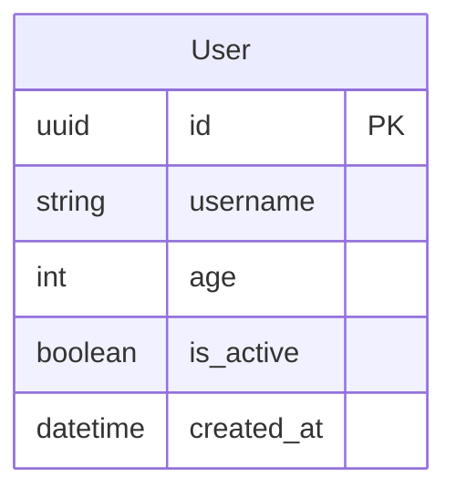
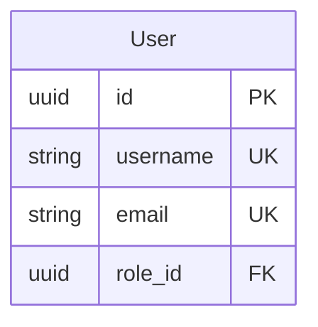

# ER Migrations 支持的数据类型

本文档列出了ER迁移系统支持的所有数据类型及其映射关系。

## 数据类型分类

### 1. 字符串类型 (String Types)

| ER图类型 | 说明 | Django映射 | SQLAlchemy映射 | 示例 |
|---------|------|-----------|---------------|------|
| `string` | 可变长度字符串 | CharField | String | `string username` |
| `varchar` | 可变长度字符串 | CharField | String | `varchar email` |
| `char` | 固定长度字符串 | CharField | String | `char code` |
| `text` | 大文本内容 | TextField | Text | `text content` |

**注意**：
- `string`、`varchar`、`char` 可以指定 `max_length`
- `text` 用于存储大量文本，不需要指定长度

### 2. 整数类型 (Integer Types)

| ER图类型 | 说明 | 位数 | Django映射 | SQLAlchemy映射 | 示例 |
|---------|------|-----|-----------|---------------|------|
| `int` | 标准整数 | 32位 | IntegerField | Integer | `int age` |
| `integer` | 标准整数 | 32位 | IntegerField | Integer | `integer count` |
| `bigint` | 大整数 | 64位 | BigIntegerField | BigInteger | `bigint total_views` |
| `smallint` | 小整数 | 16位 | SmallIntegerField | SmallInteger | `smallint likes` |
| `tinyint` | 微整数 | 8位 | SmallIntegerField | SmallInteger | `tinyint status` |

**使用场景**：
- `int` - 通用整数（年龄、数量等）
- `bigint` - 大数值（总浏览量、总金额等）
- `smallint` - 小范围数值（评分、等级等）
- `tinyint` - 极小范围数值（状态码、标志位等）

### 3. 浮点数类型 (Floating Point Types)

| ER图类型 | 说明 | 精度 | Django映射 | SQLAlchemy映射 | 示例 |
|---------|------|-----|-----------|---------------|------|
| `float` | 单精度浮点数 | 单精度 | FloatField | Float | `float rating` |
| `real` | 单精度浮点数 | 单精度 | FloatField | Float | `real weight` |
| `double` | 双精度浮点数 | 双精度 | FloatField | Float | `double score` |

**注意**：浮点数存在精度问题，不适合存储货币金额。

### 4. 精确小数类型 (Decimal Types)

| ER图类型 | 说明 | Django映射 | SQLAlchemy映射 | 示例 |
|---------|------|-----------|---------------|------|
| `decimal` | 固定精度小数 | DecimalField | Numeric | `decimal price` |
| `numeric` | 固定精度小数 | DecimalField | Numeric | `numeric amount` |

**使用场景**：
- 货币金额
- 需要精确计算的数值
- 财务数据

**参数**：
- `precision` - 总位数
- `scale` - 小数位数
- 示例：`decimal(10,2)` 表示总共10位，其中2位小数

### 5. 布尔类型 (Boolean Types)

| ER图类型 | 说明 | Django映射 | SQLAlchemy映射 | 示例 |
|---------|------|-----------|---------------|------|
| `boolean` | 布尔值 | BooleanField | Boolean | `boolean is_active` |
| `bool` | 布尔值 | BooleanField | Boolean | `bool is_enabled` |

**值**：`true` / `false` 或 `1` / `0`

### 6. 日期时间类型 (Date/Time Types)

| ER图类型 | 说明 | 格式 | Django映射 | SQLAlchemy映射 | 示例 |
|---------|------|-----|-----------|---------------|------|
| `date` | 日期 | YYYY-MM-DD | DateField | Date | `date birth_date` |
| `time` | 时间 | HH:MM:SS | TimeField | Time | `time start_time` |
| `datetime` | 日期时间 | YYYY-MM-DD HH:MM:SS | DateTimeField | DateTime | `datetime created_at` |
| `timestamp` | 时间戳 | Unix时间戳 | DateTimeField | DateTime | `timestamp updated_at` |

**使用场景**：
- `date` - 生日、纪念日等
- `time` - 营业时间、提醒时间等
- `datetime` - 创建时间、更新时间等
- `timestamp` - 与Unix系统交互时使用

### 7. 特殊类型 (Special Types)

| ER图类型 | 说明 | Django映射 | SQLAlchemy映射 | 示例 |
|---------|------|-----------|---------------|------|
| `uuid` | 通用唯一标识符 | UUIDField | UUID | `uuid id PK` |
| `json` | JSON对象 | JSONField | JSON | `json metadata` |
| `jsonb` | 二进制JSON | JSONField | JSONB | `jsonb settings` |

**使用场景**：
- `uuid` - 主键、分布式系统ID
- `json` - 灵活的结构化数据
- `jsonb` - PostgreSQL优化的二进制JSON

## 类型别名

某些类型有多个别名，它们是等价的：

| 主类型 | 别名 |
|-------|------|
| `int` | `integer` |
| `boolean` | `bool` |
| `string` | `varchar` |
| `float` | `real` |
| `decimal` | `numeric` |

## 在ER图中使用

### 基本语法



### 带约束



**注意**：Mermaid ER图语法不支持在列定义中使用引号注释。如果需要添加说明，请在文档中单独说明，或使用表级别的注释。

## 类型映射示例

### Django模型

```python
from django.db import models
import uuid

class User(models.Model):
    id = models.UUIDField(primary_key=True, default=uuid.uuid4)
    username = models.CharField(max_length=255, unique=True)
    age = models.IntegerField()
    is_active = models.BooleanField(default=True)
    created_at = models.DateTimeField(auto_now_add=True)
```

### SQLAlchemy模型

```python
from sqlalchemy import Column, String, Integer, Boolean, DateTime
from sqlalchemy.dialects.postgresql import UUID
import uuid

class User(Base):
    __tablename__ = 'user'
    
    id = Column(UUID(as_uuid=True), primary_key=True, default=uuid.uuid4)
    username = Column(String(255), unique=True)
    age = Column(Integer)
    is_active = Column(Boolean, default=True)
    created_at = Column(DateTime)
```

## 完整示例

查看 `examples/all_data_types.mmd` 文件，其中包含了所有支持的数据类型的完整示例。

生成migration：
```bash
uv run er-migrate makemigrations -n showcase -e examples/all_data_types.mmd
```

## 类型选择建议

### 存储ID
- ✅ 推荐：`uuid` - 分布式友好，无冲突
- ⚠️ 可选：`bigint` - 自增ID，简单但可能冲突

### 存储文本
- 短文本（<255字符）：`string` / `varchar`
- 长文本：`text`
- 固定长度：`char`

### 存储数字
- 整数：`int`
- 大整数：`bigint`
- 小整数：`smallint`
- 浮点数：`float` / `double`
- 货币金额：`decimal` ⚠️ 不要用float！

### 存储时间
- 只需日期：`date`
- 只需时间：`time`
- 完整时间：`datetime`
- Unix时间戳：`timestamp`

### 存储结构化数据
- JSON对象：`json` / `jsonb`
- 配置信息：`json`
- 元数据：`json`

## 注意事项

1. **精度问题**：使用 `decimal` 而不是 `float` 来存储货币
2. **性能考虑**：`jsonb` 比 `json` 更快（PostgreSQL）
3. **索引支持**：不是所有类型都支持索引
4. **数据库兼容性**：某些类型在不同数据库中的行为可能不同
5. **迁移安全**：修改列类型可能导致数据丢失，需谨慎

## 扩展阅读

- Django字段类型：https://docs.djangoproject.com/en/stable/ref/models/fields/
- SQLAlchemy列类型：https://docs.sqlalchemy.org/en/stable/core/types.html
- PostgreSQL数据类型：https://www.postgresql.org/docs/current/datatype.html
