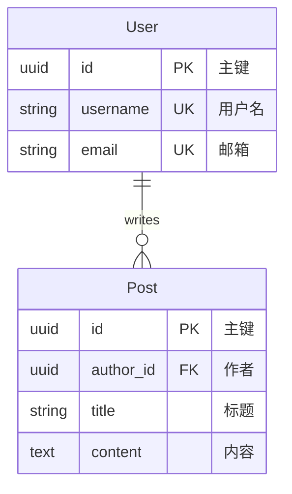

# Simple Blog - Mermaid to TOML

这个示例展示如何将 Mermaid ER 图转换为 TOML 格式。

## 示例内容

一个简单的博客系统，包含：
- **User** - 用户实体
- **Post** - 文章实体
- **关系** - User 写 Post（一对多）

## 文件说明

- `input.mmd` - Mermaid ER 图源文件
- `output.toml` - 转换后的 TOML 文件

## 转换命令

```bash
uv run er-gen-tool convert convert input.mmd -t mermaid -o output.toml
```

## Mermaid 语法示例



## 学习要点

1. **Mermaid ER 语法** - 了解 Mermaid 的实体关系图语法
2. **字段标记** - PK（主键）、FK（外键）、UK（唯一键）
3. **关系表示** - `||--o{` 表示一对多关系
4. **TOML 输出** - 查看转换后的 TOML 结构

## 使用场景

- 已有 Mermaid ER 图，想要生成代码
- 使用可视化工具设计数据模型
- 需要将图表转换为可执行代码

## 下一步

转换为 TOML 后，可以进一步转换为：
- Django 模型：`uv run er-gen-tool convert convert output.toml -f django -d models/`
- SQLAlchemy 模型：`uv run er-gen-tool convert convert output.toml -f sqlalchemy -d models/`
- 其他 Mermaid 图：`uv run er-gen-tool convert convert output.toml -f mermaid -o diagram.mmd`
