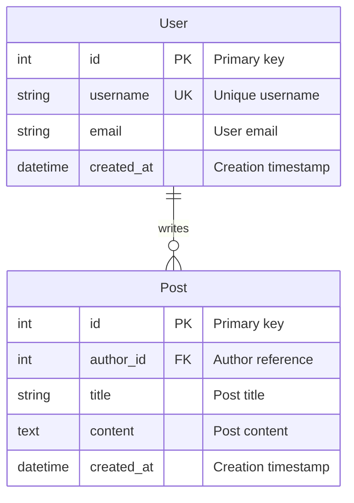
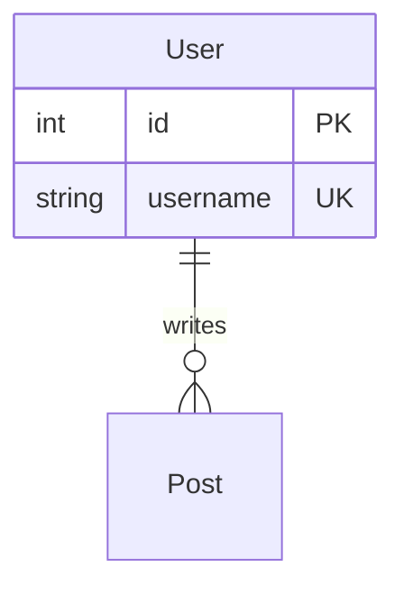

# Mermaid ER Diagram Examples

本目录包含从 TOML 转换为 Mermaid ER 图的示例。

## Mermaid ER 图特点

Mermaid 是一个基于文本的图表生成工具，ER 图特点包括：

- 纯文本定义，易于版本控制
- 可在 Markdown 中直接渲染
- 支持 GitHub、GitLab 等平台
- 清晰的可视化表示
- 易于分享和协作

## 示例列表

### [01-simple-model](01-simple-model/)
最简单的单表模型示例，包含：
- 基本实体定义
- 字段类型标注
- 主键标记（PK）

### [02-relationships](02-relationships/)
多表关系模型示例，包含：
- 实体间关系
- 一对多关系表示
- 外键标记（FK）

### [03-all-data-types](03-all-data-types/)
完整数据类型展示，包含：
- 所有支持的数据类型
- 字段约束标记（UK, PK, FK）
- 字段注释

## 转换命令

```bash
# 基本转换
uv run er-convert convert input.toml -f mermaid -o output.mmd
```

## 输出格式

转换后会生成 `.mmd` 文件，内容示例：



## 在 Markdown 中使用

将生成的 Mermaid 代码嵌入 Markdown 文件：

````markdown

````

## 关系类型表示

| 关系类型 | Mermaid 语法 | 说明 |
|---------|-------------|------|
| one-to-one | `\|\|--\|\|` | 一对一 |
| one-to-many | `\|\|--o{` | 一对多 |
| many-to-many | `}o--o{` | 多对多 |

## 字段标记

- `PK` - Primary Key（主键）
- `FK` - Foreign Key（外键）
- `UK` - Unique Key（唯一键）

## 在线预览

可以使用以下工具预览 Mermaid 图：

- [Mermaid Live Editor](https://mermaid.live/)
- GitHub/GitLab Markdown 预览
- VS Code Mermaid 插件

## 相关资源

- [Mermaid 官方文档](https://mermaid.js.org/)
- [Mermaid ER 图语法](https://mermaid.js.org/syntax/entityRelationshipDiagram.html)
- [Mermaid Live Editor](https://mermaid.live/)
