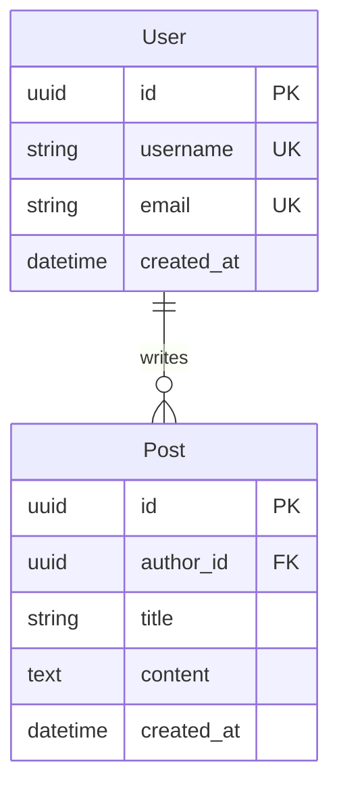
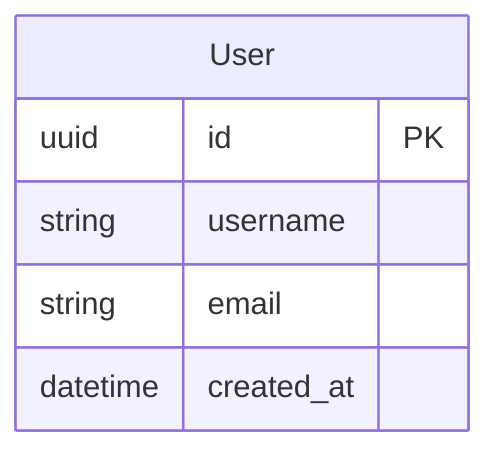
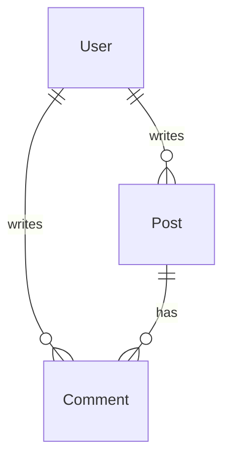
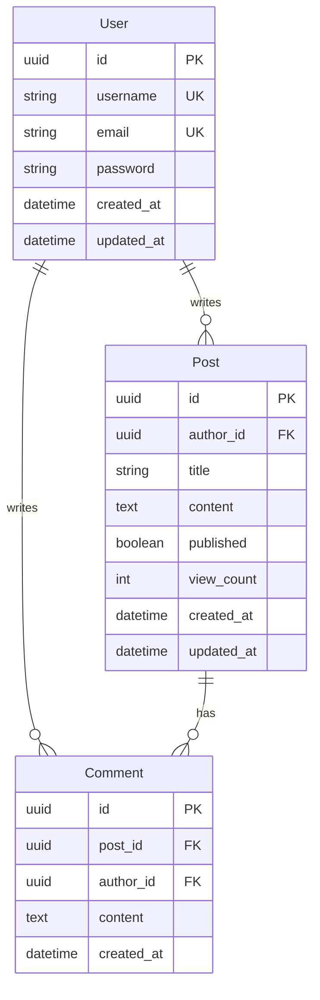

# ER Migrations

Database migration system based on ER diagrams - 基于ER图的数据库迁移系统

## 🚀 快速开始

### 安装

```bash
# 使用uv安装
uv pip install -e .

# 或使用pip
pip install -e .
```

### 基本使用

1. **创建ER图** (Mermaid格式)



2. **生成迁移**

```bash
er-migrate makemigrations -n blog -e schema.mmd
```

输出：
```
Parsing ER diagram from schema.mmd...
Generating migration for namespace 'blog'...

Migrations for 'blog':
  0001_initial.yaml

Migration saved to: .migrations/blog/0001_initial.yaml
```

3. **查看迁移状态**

```bash
er-migrate showmigrations -n blog
```

输出：
```
blog:
  [X] 0001_initial
```

## 📖 命令参考

### makemigrations

生成迁移文件

```bash
er-migrate makemigrations [OPTIONS]

Options:
  -n, --namespace TEXT    迁移命名空间 [required]
  -e, --er-file PATH      ER图文件路径 (Mermaid格式) [required]
  -d, --migrations-dir    迁移目录 [default: .migrations]
  --name TEXT             自定义迁移名称 [optional]
  --help                  显示帮助信息
```

**示例：**

```bash
# 基本用法
er-migrate makemigrations -n blog -e schema.mmd

# 指定迁移目录
er-migrate makemigrations -n blog -e schema.mmd -d ./migrations

# 自定义迁移名称
er-migrate makemigrations -n blog -e schema.mmd --name add_user_email
```

### showmigrations

显示迁移状态

```bash
er-migrate showmigrations [OPTIONS]

Options:
  -n, --namespace TEXT    显示特定命名空间的迁移
  -d, --migrations-dir    迁移目录 [default: .migrations]
  --help                  显示帮助信息
```

**示例：**

```bash
# 显示特定命名空间
er-migrate showmigrations -n blog

# 显示所有命名空间
er-migrate showmigrations

# 指定迁移目录
er-migrate showmigrations -d ./migrations
```

## 📁 迁移文件格式

迁移文件使用YAML格式，存储在 `.migrations/{namespace}/` 目录下。

**文件命名规则：** `NNNN_name.yaml`

**示例：** `.migrations/blog/0001_initial.yaml`

```yaml
version: "1.0"
name: "initial"
namespace: "blog"
dependencies: []
operations:
  - type: CreateTable
    table_name: user
    columns:
      - name: id
        type: uuid
        primary_key: true
        nullable: false
      - name: username
        type: string
        max_length: 255
        unique: true
        nullable: false
      - name: email
        type: string
        max_length: 255
        unique: true
        nullable: false
      - name: created_at
        type: datetime
        nullable: false
  
  - type: AddIndex
    table_name: user
    index:
      name: idx_user_username_unique
      columns: [username]
      unique: true
```

## 🔧 支持的操作类型

### 表操作
- `CreateTable` - 创建表
- `DropTable` - 删除表
- `RenameTable` - 重命名表

### 列操作
- `AddColumn` - 添加列
- `RemoveColumn` - 删除列
- `AlterColumn` - 修改列（只记录新值）
- `RenameColumn` - 重命名列

### 索引操作
- `AddIndex` - 添加索引
- `RemoveIndex` - 删除索引

### 约束操作
- `AddForeignKey` - 添加外键
- `RemoveForeignKey` - 删除外键
- `AlterForeignKey` - 修改外键

## 🎯 工作流程

### 1. 初始迁移

```bash
# 创建 schema.mmd
cat > schema.mmd << 'EOF'
erDiagram
    User {
        uuid id PK
        string username
    }
EOF

# 生成迁移
er-migrate makemigrations -n blog -e schema.mmd
```

### 2. 添加新字段

```bash
# 修改 schema.mmd，添加 email 字段
cat > schema.mmd << 'EOF'
erDiagram
    User {
        uuid id PK
        string username
        string email
    }
EOF

# 生成新迁移
er-migrate makemigrations -n blog -e schema.mmd
```

### 3. 查看迁移历史

```bash
er-migrate showmigrations -n blog
```

输出：
```
blog:
  [X] 0001_initial
  [X] 0002_add_email
```

## 🌟 特性

### ✅ 声明式迁移
- 只记录目标状态，不记录旧值
- 简洁清晰的YAML格式

### ✅ 命名空间隔离
- 支持多个独立的迁移命名空间
- 类似Django的app概念

### ✅ 自动依赖管理
- 自动计算迁移依赖关系
- 确保迁移按正确顺序执行

### ✅ 类型安全
- 使用Pydantic进行数据验证
- 完整的类型提示

### ✅ 智能差异检测
- 自动检测表、列、索引、外键的变更
- 无变更时不生成迁移

## 📝 ER图语法

支持Mermaid ER图语法：

### 基本实体



### 列修饰符

- `PK` - 主键
- `FK` - 外键
- `UK` - 唯一键

### 关系



关系类型：
- `||--o{` - 一对多
- `||--||` - 一对一
- `}o--o{` - 多对多

## 🔍 示例

### 完整示例：博客系统

**schema.mmd:**



**生成迁移：**

```bash
er-migrate makemigrations -n blog -e schema.mmd
```

**生成的迁移文件：** `.migrations/blog/0001_initial.yaml`

包含：
- 3个CreateTable操作（User, Post, Comment）
- 2个AddForeignKey操作（Post.author_id, Comment.post_id, Comment.author_id）
- 2个AddIndex操作（username, email的唯一索引）

## 🛠️ 高级用法

### 多命名空间

```bash
# auth命名空间
er-migrate makemigrations -n auth -e auth.mmd

# blog命名空间
er-migrate makemigrations -n blog -e blog.mmd

# 显示所有命名空间
er-migrate showmigrations
```

### 自定义迁移目录

```bash
# 使用自定义目录
er-migrate makemigrations -n blog -e schema.mmd -d ./db/migrations

# 查看自定义目录的迁移
er-migrate showmigrations -d ./db/migrations
```

### 自定义迁移名称

```bash
# 使用描述性名称
er-migrate makemigrations -n blog -e schema.mmd --name add_user_profile_fields
```

## 🐛 故障排除

### 问题：迁移文件未生成

**原因：** 没有检测到变更

**解决：** 确保ER图与上次生成的迁移有差异

### 问题：解析ER图失败

**原因：** ER图语法错误

**解决：** 检查Mermaid语法是否正确

### 问题：找不到命令

**原因：** 未安装或未添加到PATH

**解决：**
```bash
# 重新安装
uv pip install -e .

# 或使用完整路径
uv run er-migrate --help
```

## 📚 相关文档

- [设计文档](../../.kiro/specs/er-migrations/design.md)
- [测试场景](../../.kiro/specs/er-migrations/test-scenarios.md)
- [TDD总结](../../.kiro/specs/er-migrations/TDD-SUMMARY.md)

## 🤝 贡献

欢迎贡献！请遵循TDD方法：

1. 先写测试
2. 看到测试失败
3. 实现功能
4. 测试通过
5. 重构

## 📄 许可证

MIT License

## 🙏 致谢

本项目使用TDD方法开发，78个测试全部通过！
